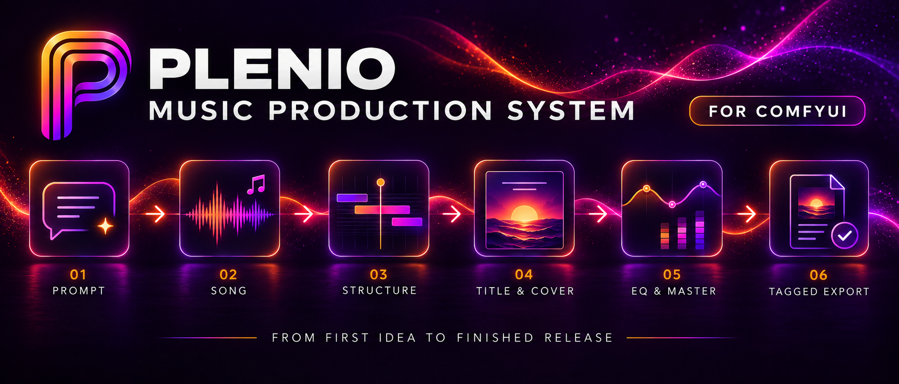

# Plenio Music Production System 0.2 for ComfyUI

<p align="center">
  
</p>

**Make songs locally in ComfyUI - and see exactly what the music model is given.** Describe a song and a local language model writes it. YuE2 or MiniMax Music 3 performs it, Plenio masters it and exports it with tags, cover art and a record of how it was made. You can also turn an existing recording into a new version of itself, or finish and master a file you already have.

Everything runs on your own machine, inside ComfyUI's own nodes: no cloud service, no API key, no extra Python packages. Before a single note is rendered, the **Song Sheet** shows you the title, style, lyrics and score that the model will receive. You can edit all of them, and your edits are never silently overwritten.

## Listen first

**🎧 [Open the demo gallery](https://jplenio.github.io/Plenio-Music-Production-System/)** - 35 generated songs and 8 cover versions, with search, filters and the settings behind each track. Instrumental and vocal, YuE2, YuE2 Cover and MiniMax Music 3.

**🔊 [SoundCloud playlist](https://soundcloud.com/pelenio/sets/minimax-music-3-comfyui)** · a sample file with its full prompt report: [`assets/sound-samples`](assets/sound-samples/)

The demos were made with the same music models by Plenio's predecessor, the [Music Production Toolkit](https://github.com/jplenio/ComfyUI-MiniMax-Music-Production-Toolkit) (see [Coming from the Music Production Toolkit?](#coming-from-the-music-production-toolkit)).

## What is new: one clear path per model, and nothing hidden

Plenio is a rewrite from scratch, not a new version of the toolkit. It keeps what worked, the models, the prompt library and the mastering algorithms, and changes how everything fits together:

- **One template per music model.** *YuE2 · Song*, *YuE2 · Cover* and *MiniMax · Song* each show only the controls that apply to them. There is no model switch that half the nodes ignore.
- **The Song Sheet: what you see is what the model gets.** Every document that conditions the music (title, style or caption, lyrics, score) passes through one sheet. Each document is *automatic*, *edited* or *manual*. Manual text is never replaced. If the draft changes under an edit, the run stops and asks instead of guessing. Set a sheet to *stop for review* and nothing is rendered until you approve exactly what you saw.
- **A real score editor.** YuE2's score is ABC notation, and the Song Sheet opens it as notation, as ABC text and with playback. You can transpose, change notes, rename, move or split sections, and A/B the score against the source recording of a cover. Every edit is checked by the same parser the model uses.
- **Covers from the actual music.** SheetSage2 reads the score out of your recording and keeps its beat grid. faster-whisper transcribes the sung words and places them into the score's sections. You choose *instrumental*, *original lyrics* or *new lyrics* (written to the phrasing of the original), and whether the harmony stays.
- **Finishing built in.** Every song template ends in **Plenio · Master**: a gentle tone match, compression and a true-peak limiter to **-14 LUFS / -1 dBTP**. Export writes FLAC 24-bit, MP3 V0 or WAV 32-bit float with tags and cover art, the unmastered take, and a **release record** of the documents, seeds, settings, loudness and model licences.
- **Native ComfyUI all the way.** Generation, loaders, samplers, loops and downloads are ComfyUI's own nodes. Plenio adds 14 small nodes where ComfyUI has nothing equivalent (the predecessor had 55). ComfyUI manages GPU memory and offers missing model downloads itself.

## The templates

Open them from ComfyUI's template browser (listed under this package's name):

| Template | For |
|---|---|
| **0 · System Check** | versions, GPUs, which model files each template still needs, and a hardware table with your row marked |
| **1 · YuE2 · Song** | new songs with YuE2, sung or instrumental, with an editable score ([guide](docs/user/paths/yue2-song.md)) |
| **2 · YuE2 · Cover** | a new version of a recording you own or may use: instrumental, original or new lyrics ([guide](docs/user/paths/yue2-cover.md)) |
| **3 · MiniMax · Song** | new songs with MiniMax Music 3 and its structured caption ([guide](docs/user/paths/minimax-song.md)) |
| **4 · Enhance & Master** | EQ, loudness and export for a file you already have; runs on the CPU ([guide](docs/user/paths/enhance-master.md)) |

Every template reads left to right in numbered groups: **SONG → WRITE → SHEET → RENDER → FINISH**. An *About this template* note explains the path in a few steps, and optional blocks (Cover Art, the instrumental adapter) are marked *(optional)* and switched off until you want them. Templates 0, 1, 3 and 4 also run as a simple form in ComfyUI's **App mode**.

<p align="center">
  
</p>

*1 · YuE2 · Song: the brief on the left, the Song Sheets in the middle, render, mastering and export on the right.*

### Make a new song

1. Open **1 · YuE2 · Song** or **3 · MiniMax · Song**. ComfyUI offers to download missing model files.
2. Fill in the **Song Brief**: pick one of about 240 genre templates or describe your own idea; set mood, tempo, length, vocals (language, voice, theme) or *instrumental*.
3. Queue. The writer (Gemma 4 through ComfyUI's native text generation) drafts title, style and lyrics; YuE2 plans a score; the Song Sheets show both.
4. Listen, then queue again for a new take: the take seed changes, the draft and the plan stay cached and your edits stay valid.

### Make a cover

1. Open **2 · YuE2 · Cover** and load the source recording.
2. Choose the target style in the **Cover Brief**, the vocals (*instrumental* by default, the instrument plays the vocal melody) and the harmony.
3. Queue: the run stops at **Song Sheet · Score** and later at **Song Sheet · Text**, so you can inspect and edit the transcribed score and the lyrics before YuE2 renders.

### Edit the score

<p align="center">
  
</p>

*The Song Sheet editor: notation and ABC side by side, sections, validation and playback.*

Open a Song Sheet and choose the score tab: select notes in the notation or the text, change pitch or length, transpose, set the tempo, remove chords, move the vocal line to the instrument, and rename, move, split or merge sections. Undo and redo work, and every result is validated before it is kept. See the [score editor guide](docs/user/concepts/score-editor.md).

### Finish a recording

<p align="center">
  
</p>

*4 · Enhance & Master: load a file, shape it with the EQ curve, set the loudness target and export with its own tags and cover.*

## Mastering and export

- **EQ**: up to 8 parametric bands with a live response curve, or *tone match*: a gentle tilt (*warm*, *bright*) or the long-term spectrum of a reference recording, within a maximum gain you set.
- **Loudness & Dynamics**: BS.1770-4 loudness, EBU loudness range, 4x oversampled true peak; a soft-knee compressor and a lookahead true-peak limiter. The default target is -14 LUFS / -1 dBTP, and the result is measured and reported. If the target cannot be reached within the gain and limiter budgets, you get the best result within them and a note.
- **Export Release**: FLAC 24-bit, MP3 V0 (above 48 kHz converted for the MP3 only), WAV 32-bit float; title, artist, album, date, track, genre, comment, album artist and composer, typed or copied from the loaded file; embedded cover art (with the optional `mutagen`). Every export also writes a `.plenio.json` release record.

Details and limits: [Mastering and audio formats](docs/user/concepts/mastering.md).

## Built for different computers

The **0 · System Check** template reads your GPU and marks your row. Nothing is switched automatically; you choose the model files in the loaders.

| GPU memory | YuE2 | MiniMax Music 3 | Cover Art (FLUX.2 Klein 4B) |
|---|---|---|---|
| below 8 GB | only with heavy offloading (the int8 model alone is 4 GB): very slow, keep songs short | only with heavy offloading: very slow | not practical |
| 8-12 GB | int8 checkpoint (template default); keep songs short | int8 DiT `minimax_music3_dit_int8_convrot` (2.5 GB) and *tiled decode* | `flux-2-klein-4b-fp8` with the text encoder `qwen_3_4b_fp4_flux2` |
| 12-16 GB | int8 checkpoint (template default) | the defaults may offload; the int8 DiT is the safer choice | fp8 model and fp4 text encoder |
| 16-24 GB | int8 checkpoint with the Gemma 4 E4B writer | template defaults (fp16 DiT, int8 text encoder) | template defaults (bf16) |
| 24 GB and more | the bf16 checkpoint `yue2_3b_bf16` (7.8 GB) is possible; int8 stays the faster default | template defaults | template defaults |

YuE2 is measured on a 16 GB RTX 5060 Ti; the other rows come from model sizes and the predecessor toolkit's ratings. *4 · Enhance & Master* needs no GPU. See [Models and downloads](docs/user/models.md) for every file, folder and size.

## Installation

Requires **ComfyUI 0.37.0 or newer**; it provides the native YuE2, SheetSage2, MiniMax Music 3, FLUX.2 and text-generation nodes Plenio builds on.

**ComfyUI Manager:** open *Manager → Custom Nodes Manager*, search for **Plenio Music Production System** and install it. Restart ComfyUI.

**Comfy CLI:**

```bash
comfy node install comfyui-plenio-music
```

**By hand:**

```bash
cd ComfyUI/custom_nodes
git clone https://github.com/jplenio/Plenio-Music-Production-System
```

Restart ComfyUI, open **0 · System Check** from the template browser and run it. Plenio installs no Python packages. Two features are optional and tell you the command when you use them: `python -m pip install faster-whisper` for covers with lyrics, and `python -m pip install mutagen` to embed cover art in the audio files (GPL-2.0, never installed by Plenio). Model files come through ComfyUI's missing-model dialog when you open a template, or [by hand](docs/user/models.md).

## Coming from the Music Production Toolkit?

Plenio is the successor of the [Music Production Toolkit](https://github.com/jplenio/ComfyUI-MiniMax-Music-Production-Toolkit) (formerly *MiniMax Music Production Toolkit*). So much changed that it became a new project. The old name also no longer fit, because MiniMax is one of three music paths, not the whole story.

- **New package, new node IDs.** Both can be installed side by side, and old workflows keep working with the old toolkit. There is no automatic migration of saved workflows; start from the new templates.
- **Carried over deliberately:** the prompt template library (re-checked, 239 templates), the EQ and loudness presets, the compressor and limiter (ported and verified sample by sample against the toolkit's output), and the lessons of its cover work.
- **Replaced:** the llama.cpp LLM node by ComfyUI's native text generation; the model downloader and advisor by ComfyUI's missing-model dialog and the System Check; the cover studio's freedom slider by an editable score and explicit brief choices; FlashSR and the restoration chain are not part of Plenio (the tested takes showed no need for it).

## Documentation

- Users: [Getting started](docs/user/getting-started.md) · [YuE2 Song](docs/user/paths/yue2-song.md) · [YuE2 Cover](docs/user/paths/yue2-cover.md) · [MiniMax Song](docs/user/paths/minimax-song.md) · [Enhance & Master](docs/user/paths/enhance-master.md) · [Song Sheet](docs/user/concepts/song-sheet.md) · [Score editor](docs/user/concepts/score-editor.md) · [Instrumental](docs/user/concepts/instrumental.md) · [Mastering](docs/user/concepts/mastering.md) · [App mode](docs/user/concepts/app-mode.md) · [Models](docs/user/models.md) · [Configuration](docs/user/configuration.md) · [Licensing](docs/user/licensing.md) · [Troubleshooting](docs/user/troubleshooting.md)
- Contributors: [Architecture](docs/dev/architecture.md) · [Extending Plenio](docs/dev/extending.md) · [Testing](docs/dev/testing.md) · [Design documents](docs/design/README.md) · [Decisions](docs/adr/README.md) · [Acceptance review](docs/audit/2026-09-25-phase-10-acceptance.md)
- [Changelog](CHANGELOG.md)

## A few honest limits

- YuE2 sometimes renders a take to the length ceiling and stops mid-phrase; render another take. *Instrumental* is a strong request, not a guarantee: the optional *Check Vocals* measures the take and keeps the cleanest one.
- The ASR can mishear words. A cover shows unsure words highlighted so you can correct them before rendering.
- SheetSage2 reads one 300-second window at a time; on 16 GB cards, trim longer sources.
- Mastering is whole-song loudness with a gentle tone match. There is no restoration, no fades and no multiband processing.

## Licences

- Plenio's code: **Apache-2.0** ([LICENSE](LICENSE), [NOTICE.md](NOTICE.md)); bundled frontend libraries: [THIRD_PARTY.md](THIRD_PARTY.md).
- **Model weights have their own licences and are not included.** YuE2, YuE2-VAE, SheetSage2 and the instrumental adapter are **CC BY-NC 4.0 (non-commercial)**. MiniMax Music 3 uses the MiniMax-Music3 Community License with commercial conditions. FLUX.2 Klein 4B, the Gemma 4 writer and faster-whisper are Apache-2.0 or MIT. The release record names the licences of the models a song was made with; see [Licensing](docs/user/licensing.md).

Created by [Johannes Plenio](https://github.com/jplenio). This is an independent community project.
