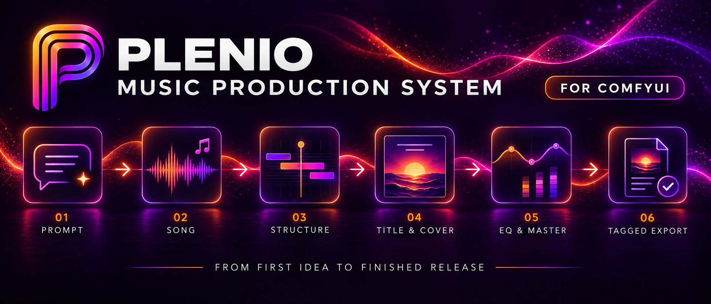
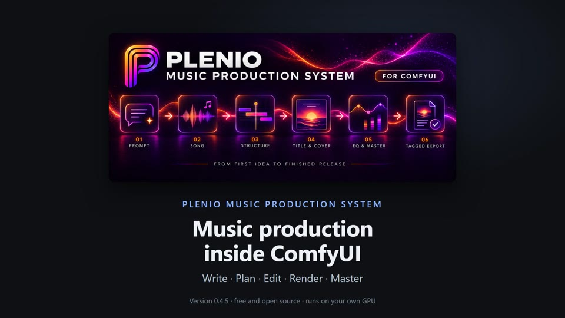
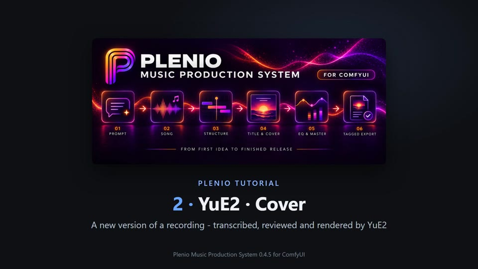
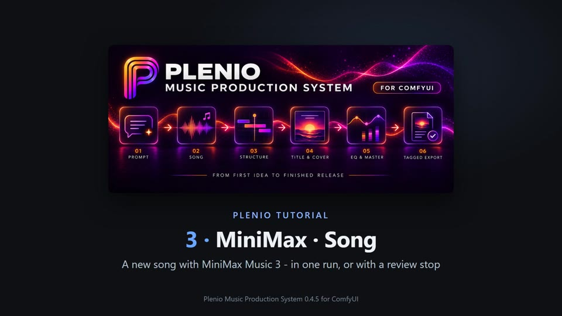
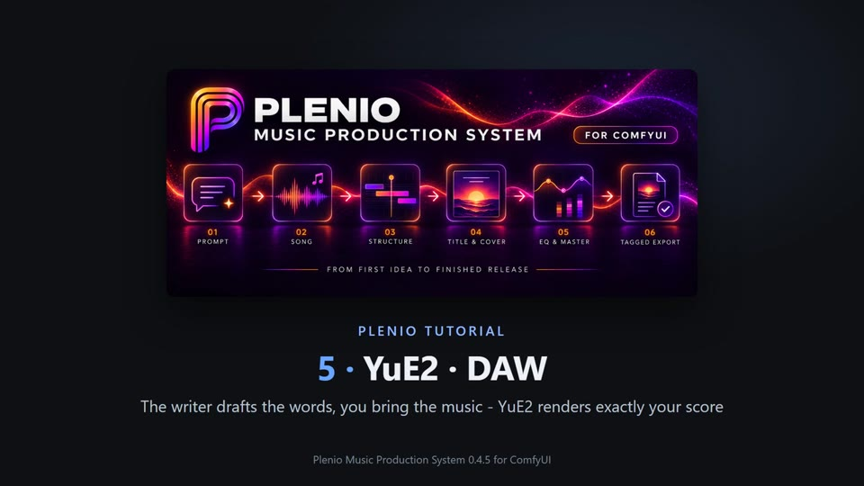
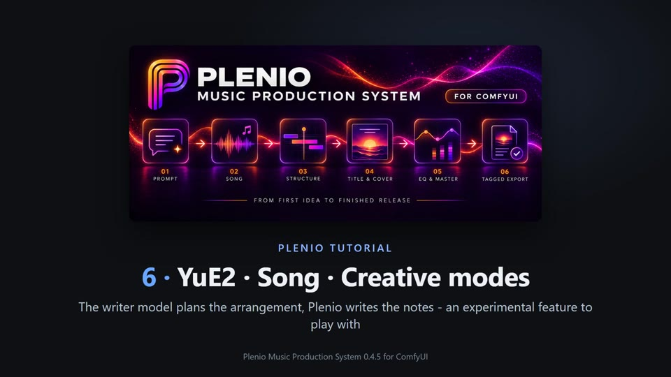
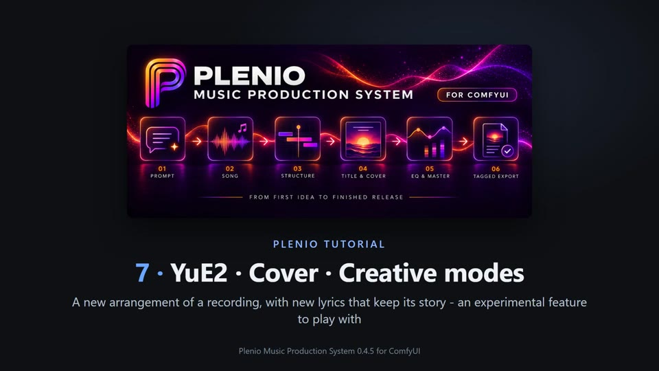

<p align="center">
  
</p>

# Plenio Music Production System 0.5 for ComfyUI

<p align="center">
  <a href="https://youtu.be/XpNpks9ZCgE"></a>
</p>

<p align="center"><b>▶ <a href="https://youtu.be/XpNpks9ZCgE">Your idea. Your song. Your control.</a></b> - Plenio in 54 seconds</p>

**Make songs locally in ComfyUI - and see exactly what the music model is given.** Describe a song and a local language model writes it. YuE2 or MiniMax Music 3 performs it, Plenio masters it and exports it with tags, cover art and a record of how it was made. You can also turn an existing recording into a new version of itself, compose the score yourself, split a finished song into stems to rebalance it, or finish and master a file you already have.

Everything runs on your own machine, inside ComfyUI's own nodes: no cloud service, no API key, no extra Python packages. Before a single note is rendered, the **Song Sheet** shows you the title, style, lyrics and score that the model will receive. You can edit all of them, and your edits are never silently overwritten.

What changed in each version is in the [changelog](CHANGELOG.md).

## Watch the tutorials

**▶ [Plenio in 75 seconds](https://youtu.be/q_dMH834E1o)** - the promo: what Plenio does, from the first idea to the mastered song.

<p align="center">
  <a href="https://youtu.be/q_dMH834E1o"></a>
</p>

**▶ [All tutorials as a YouTube playlist](https://www.youtube.com/playlist?list=PLAFqTtP59fgE)** - one narrated video for every template and two for the creative modes (English, 2 to 15 minutes, with chapters), recorded in ComfyUI with the real models: every song you hear in them was made right there. Watch them in order, or jump to the template you need.

| | Tutorial | What you will see |
|:---:|---|---|
|  | **0 · System Check** | Is your ComfyUI ready? Versions, the GPU, the model files every template needs and the hardware table with your machine's row. |
|  | **1 · YuE2 · Song** | From a brief to a finished song - as a series or one song with review stops, with the writer model of your choice and the sheet music PDF of every export. Then a tour of the score editor: notes, lyrics, playback, track sounds and presets, copy and paste, arranging sections and bars, recording with a MIDI keyboard, the files. |
|  | **2 · YuE2 · Cover** | A recording becomes a new version. In the score editor the original plays under the notes (waveform, A/B), a copied chorus sings its words again, and the sheet music goes out as files. |
|  | **3 · MiniMax · Song** | Songs with MiniMax Music 3: the caption, the lyrics and the 5,000-token budget, checked before anything is rendered. |
|  | **4 · Enhance & Master** | Master any recording without a GPU: a warm tone match, measured loudness and the release export - then your own sound. |
|  | **5 · YuE2 · DAW** | Compose it yourself: the words first, then the music - draw the notes, import a MIDI sketch or play it in with a MIDI keyboard - and YuE2 sings your melody. |
|  | **6 · YuE2 · Song · Creative modes** *(experimental)* | The writer model plans the arrangement, Plenio writes the notes: a *dramatic* song, its arranged score in the Song Sheet, the rendered song - and another arrangement from the arrangement seed. |
|  | **7 · YuE2 · Cover · Creative modes** *(experimental)* | A recording re-arranged for a full ensemble, with new lyrics that keep its story - *song flow closeness* and *lyrics closeness*, A/B against the original, the cover and its sheet music. |

## Listen first

**🎧 [Open the demo gallery](https://jplenio.github.io/Plenio-Music-Production-System/)** - 30 songs made with Plenio 0.2.2 and YuE2 (one per genre, straight out of the templates), 35 MiniMax Music 3 songs and 8 cover versions, with search, filters and everything the model received for each track.

**🔊 [SoundCloud playlist](https://soundcloud.com/pelenio/sets/minimax-music-3-comfyui)** · a sample file with its full prompt report: [`assets/sound-samples`](assets/sound-samples/)

The demos were made with the same music models by Plenio's predecessor, the [Music Production Toolkit](https://github.com/jplenio/ComfyUI-MiniMax-Music-Production-Toolkit) (see [Coming from the Music Production Toolkit?](#coming-from-the-music-production-toolkit)).

## What Plenio does: one clear path per model, and nothing hidden

- **One template per music model.** *YuE2 · Song*, *YuE2 · Cover* and *MiniMax · Song* each show only the controls that apply to them. There is no model switch that half the nodes ignore.
- **Two ways to work, chosen first in the brief.** *New song every run* turns one brief into a whole series: set the number of runs, press Run once, and every run writes and renders a different song. *One song, stop to review* is for the song you want to get right: the run stops at the Song Sheets so you can check and edit the text and the score before anything is rendered, and every later run is a new take of the approved song.
- **The Song Sheet: what you see is what the model gets.** Every document that conditions the music (title, style or caption, lyrics, score) passes through one sheet. Each document is *automatic*, *edited* or *manual*. Manual text is never replaced. If the draft changes under an edit, the run stops and asks instead of guessing. When a sheet stops for review, nothing is rendered until you approve exactly what you saw.
- **A real score editor.** YuE2's score is ABC notation, and the Song Sheet opens it as notation, as a **piano roll** and as ABC text, with playback. Draw, move and resize notes, set **chord symbols** in the chord lane, work through the **bar inspector** (bars, meter, key changes), and export or import **MIDI**. Play a melody in with a **MIDI keyboard** (record with count-in, or step input), hear every track in a **sound** of its own, set them with **presets** for the kind of song, and export the sheet music as **PDF, PNG or SVG** in four sizes. Every edit is checked by the same parser the model uses; a malformed text is refused with a reason and can be reverted.
- **Arrange like in a DAW.** Copy, move and delete whole sections in the section list, as on Cubase's arranger track - or single bars in the bar strip under it. A **cursor** in the ruler sets where playback and paste start, and **Ctrl+V** / **Ctrl+Shift+V** paste at it, overwriting or inserting time. The Guide track, the lyrics and, in covers, the original words and the source recording's times follow every arrangement. The **lyrics** stand over the notes they are sung on and are edited right there - their lines are moved, made longer or shorter, copied and pasted like notes, and chord symbols move by semitones with the notes. The sheet music goes out as **MusicXML**, and a **project file** keeps the score, the Guide notes and the lyrics to go on later.
- **Or write the score yourself.** **5 · YuE2 · DAW** is the song template for composing: an all-rest score is built from the brief, you draw the melody and the chords - play them in with a **MIDI keyboard** or bring a sketch from your DAW with **Import MIDI…** - and YuE2 renders exactly what you approved. The **Guide** track plays with the sheet but is never sent to the model.
- **Covers from the actual music.** SheetSage2 reads the score out of your recording and keeps its beat grid. faster-whisper transcribes the sung words and places them into the score's sections. You choose *instrumental*, *original lyrics* or *new lyrics* (written to the phrasing of the original and fitted to its melody line by line), and whether the harmony stays; the cover is named after its source (`<title>-cover`). In the score editor the source recording plays under the notes, bar by bar, and the **sung pitch** is drawn over them, so you hear and see where the transcription is off.
- **After the render, before the master.** **Refine (48 kHz)** can extend a band-limited render with a super-resolution model or just resample it; **Stems** splits a song into vocals, drums, bass and other and mixes them back with a **residual** that keeps a neutral mix exact. Both are optional blocks in every template, bypassed until you switch them on.
- **Finishing built in.** Every song template ends in **Plenio · Master**: a gentle tone match, compression and a true-peak limiter to **-14 LUFS / -1 dBTP**. Export writes FLAC 24-bit, MP3 V0 or WAV 32-bit float with tags and embedded cover art, the unmastered take, a **release record** of the documents, seeds, settings, loudness and model licences - and, for YuE2, the **sheet music as a PDF**.
- **Video tutorials for every template** and for the creative modes, narrated and recorded with the real models - [watch them](#watch-the-tutorials).
- **Your own local LLMs as the writer.** The **Local LLM** node runs any GGUF from ComfyUI's `models/LLM` folder (or from LM Studio and the Hugging Face cache) in a llama.cpp server that is started for the draft and gone afterwards, so the GPU is free again for the music model - or asks a running LM Studio, Ollama, llama.cpp, vLLM or Jan. *Write Song*'s **writer model** lists them next to the native Gemma 4 writer (the default) - choose one, and only that one is loaded. No extra packages ([guide](docs/user/concepts/local-llm.md)).
- **Creative modes and closeness sliders (experimental).** Besides the plain generation (arrangement *off*), *standard*, *varied*, *fantasy*, *sterile*, *many instruments* and *dramatic* shape the writing and let the writer model plan every section of YuE2's score - chords, what the instrument line plays, energy, a key lift - with a slider for how close a song stays to its genre, and for covers how close the song flow and the new lyrics stay to the original. The writer plans, Plenio writes and checks every note - chords that carry the melody, instrument lines that leave room for the voice, key lifts that are led in: the score always stays valid, and a plan that cannot be used leaves it as it was, said in the Song Sheet. **Experimental:** the results can surprise - try the modes, listen and keep what you like; *off* stays the dependable choice ([guide](docs/user/concepts/creative-modes.md)).
- **Native ComfyUI all the way.** Generation, loaders, samplers, loops and downloads are ComfyUI's own nodes. Plenio adds 25 small nodes where ComfyUI has nothing equivalent (the predecessor had 55), and every field explains itself in a tooltip. ComfyUI manages GPU memory and offers missing model downloads itself.

## The templates

Open them from ComfyUI's template browser (listed under this package's name):

| Template | For |
|---|---|
| **0 · System Check** | versions, GPUs, which model files each template still needs, and a hardware table with your row marked |
| **1 · YuE2 · Song** | new songs with YuE2, sung or instrumental, with an editable score ([guide](docs/user/paths/yue2-song.md)) |
| **2 · YuE2 · Cover** | a new version of a recording you own or may use: instrumental, original or new lyrics ([guide](docs/user/paths/yue2-cover.md)) |
| **3 · MiniMax · Song** | new songs with MiniMax Music 3 and its structured caption ([guide](docs/user/paths/minimax-song.md)) |
| **4 · Enhance & Master** | EQ, loudness and export for a file you already have; runs on the CPU ([guide](docs/user/paths/enhance-master.md)) |
| **5 · YuE2 · DAW** | compose the score yourself: piano roll, chord symbols and the Guide track ([guide](docs/user/paths/yue2-daw.md)) |

Every template reads left to right in numbered groups: **SONG → WRITE → SHEET → RENDER → FINISH** (the DAW template adds **DAW** and **FINISH** groups of its own). An *About this template* note explains the path in a few steps, and optional blocks (Cover Art, the instrumental adapter, Refine, Stems) are marked *(optional)* and switched off until you want them. All six templates also run as a simple form in ComfyUI's **App mode**; the Song Sheet buttons work there too, so you can review and edit without the graph.

### Two ways to work

The first field of the **Song Brief** (and of the **Cover Brief**) is the **mode**:

| Mode | What a run does | Use it for |
|---|---|---|
| **new song every run** (song default) | writes and renders a **different song** from the same brief every time - its own title, story and hook - without stopping. Set *Number of runs* in App mode, or the batch count next to **Run**, and one click makes a whole series; every song is exported under its own name. | many songs in one style, finding ideas, overnight batches |
| **one song, stop to review** | stops at the **Song Sheets**: check or edit title, style, lyrics and (YuE2) the score, press *Approve*, run again. After that every run is a **new take** of the same approved song. | the one song you want to get right |

**Where the run stands** is shown on the nodes: before a run every Song Sheet that will stop carries **⏸ review stop**; after a run each Plenio node shows ✓, ⚠ or ✖, and the sheet where the run waits shows **⏸ waiting for your approval** with an amber frame (and a message says what to do). The line under the sheet's button says the same in App mode.

The cover template has the same choice (*one cover, stop to review* is its default; *new cover every run* writes a new version - title, style and, with new lyrics, the lyrics - on the same transcription every time). The Song Sheets follow the brief (*review: as the brief says*); you can still set a single sheet to *continue* or *stop for review*.

<p align="center">
  
</p>

*1 · YuE2 · Song: the brief on the left, the writer and the Song Sheets in the middle, render, mastering and export on the right; the model block and the optional Stems, Refine and Cover Art blocks sit below.*

**App mode** - the same templates as a simple form, without the graph:

| 1 · YuE2 · Song | 3 · MiniMax · Song | 4 · Enhance & Master |
|---|---|---|
|  |  |  |

*The apps also show the mode and the Song Sheet buttons.*

### Make a new song

1. Open **1 · YuE2 · Song** or **3 · MiniMax · Song**. ComfyUI offers to download missing model files.
2. Choose the **mode** in the **Song Brief** (see [Two ways to work](#two-ways-to-work)).
3. Fill in the brief: pick one of about 240 genre templates or describe your own idea; set mood, tempo, length (1:00 to 6:00), vocals (language, voice, theme) or *instrumental*.
4. Queue. The writer (Gemma 4 through ComfyUI's native text generation) drafts title, style and lyrics; YuE2 plans a score; the Song Sheets show both.
5. *New song every run:* every further run is the next song of the series (set the **Draft seed** to *randomize* for even more variety). *One song, stop to review:* approve the sheets, then every further run is a new take - the take seed changes, the draft and the plan stay cached and your edits stay valid.
6. Want more than YuE2's own plan? Choose a **creative mode** in the brief's *arrangement* (and its *genre closeness*): the writer then plans every section of the score, and **Song Sheet · Score** shows the arranged score and what was changed. *Arrangement seed* gives another arrangement of the same song ([Creative modes](docs/user/concepts/creative-modes.md)).

### Make a cover

1. Open **2 · YuE2 · Cover** and load the source recording.
2. Choose the mode, the target style in the **Cover Brief**, the vocals (the template starts with the *original lyrics* on the style template *pop/dance-pop-vocal*; *instrumental* lets an instrument play the vocal melody) and the harmony (the template starts with *keep original chords*). With an empty title the cover is named after its source recording: `<title>-cover`.
3. Queue: with *one cover, stop to review* the run stops at **Song Sheet · Score** and later at **Song Sheet · Text**, so you can inspect and edit the transcribed score and the lyrics before YuE2 renders. With *new cover every run* it renders straight through, a new version every run.
4. Optional: a **creative mode** re-arranges the transcription within the *song flow closeness* (100 the original ... 0 only a hint; the melody and the form always stay), and with *new lyrics* the *lyrics closeness* sets how close the new words stay to the original ones.

<p align="center">
  
</p>

*2 · YuE2 · Cover: source and Cover Brief, then Song Sheet · Score and Song Sheet · Text with their review stops, render, mastering and export.*

### Edit the score

Open a Song Sheet and choose the score tab. The **piano roll** draws, moves and resizes notes (Review mode: into rests, **Alt** to overwrite) and in its *Select* mode frames several notes at once, the **chord lane** takes chord symbols, the **inspector** handles the bar the selection starts in (insert, duplicate, delete, meter, key changes), and the notation and the ABC text stay in sync with the selection. **Export MIDI** writes the score (and the Guide notes) as a type-1 file; **Import MIDI…** shows the file's tracks with a role each, its grid and what the import would change *before* it replaces anything - and can read chord symbols from a Chords track. Undo and redo work, and every result is validated before it is kept.

The editor also arranges. Select sections in the list and duplicate (Ctrl+D), copy, move (Ctrl+↑/↓ or drag; Alt copies) or delete them - and single bars the same way in the bar strip under the sections. Click in the ruler to set the **cursor**: playback starts there, and **Ctrl+V** pastes the clipboard there, overwriting the notes of its voices, while **Ctrl+Shift+V** inserts it and moves what follows. When the song has lyrics, a **lyrics lane** shows every line over the notes it is sung on: a double-click edits it, and lines are selected, moved, made longer or shorter, deleted, copied and pasted like notes; the notation shows the syllables under the notes. **Export MusicXML** hands the sheet music to MuseScore, Sibelius, Dorico or Cubase, **Export notation…** gives it as PDF, PNG or SVG in four sizes, **♫ sounds** plays each track in its own sound (piano, strings, pad, voice ... - with presets by kind of song, and your own), and **Save project / Open project…** keeps the score, the Guide notes, the lyrics and these settings in one file. See the [score editor guide](docs/user/concepts/score-editor.md).

<p align="center">
  
</p>

*The score tab of a Song Sheet in the DAW layout, playing the chorus of a sketch brought in with Import MIDI: the chord lane and the lyrics lane over the piano roll (each line over its phrase, each syllable over its note), the **transport** right under the roll (play, ● rec and step input with a MIDI keyboard, ♫ sounds, loop, metronome, the voices, speed), the notation with the syllables under the notes, the files (MIDI, MusicXML, the notation as PDF or picture, the project) - and on the left the four **tracks**, each with its sound.*

Every track plays in a sound of its own - piano, electric piano, strings, pad, organ, flute, a sung “ah”, pluck, synth lead, bass, mallets - synthesized in the browser, so nothing is downloaded. **Presets** set the sounds and the basic settings for a kind of song (pop, ballad, rock, electronic, acoustic, jazz, orchestral) or a way of working (composing with a MIDI keyboard, checking a cover's transcription, a free cover arrangement); **save current as preset…** keeps your own in ComfyUI, for every song. **Export notation…** gives the sheet music as a PDF on A4 or Letter pages, as a PNG or SVG picture, or prints it - and *Export Release* saves that PDF of the final score with the lyrics automatically next to the song (`<name>.pdf`, the YuE2 templates on A4).

| | |
|:---:|:---:|
|  |  |
| *♫ sounds: a preset for the kind of song, a sound per track, ▶ to hear it* | *Export notation… → PDF: the first page of the sketch's sheet music* |

For a **cover** the source recording is a track of its own, like an audio track under the MIDI in a DAW: its **waveform** runs under the chord and lyrics lanes, **hear: both** plays the notes and the recording together on the transcription's beat grid (**A/B** switches at once), **⇆ align** moves the recording when the beat detection was off, and the **Sung Pitch** node draws the sung melody as a curve over the notes - so a wrong pitch, an octave off or a missed note shows at a glance. Quantize (Q), vertical zoom and a *follow* switch round off the roll; **⌨ keys** lists every key and gesture.

<p align="center">
  
</p>

*A cover's chorus playing in Song Sheet · Score: the source recording's waveform over the roll, the sung pitch (pink) over the transcribed notes - here an octave lower in the singing, so the curve is drawn in the notes' octave (*sung +8va*) - and the transport with **hear: both**, **A/B** and **⇆ align**. *wave* and *sung* in the roll's toolbar hide both for a cover that goes far from the original.*

### Compose a song yourself (YuE2 · DAW)

Open **5 · YuE2 · DAW**, describe the song in the brief and run: the run stops at **Song Sheet · Text** with the writer's lyrics; approve them and run again. *Score Tools* builds an empty score in the right length, meter and key, and the run stops at **Song Sheet · DAW**. Draw the notes, set the chords, split the score into sections - or press **Import MIDI…** and bring a sketch from your DAW: the dialog shows every track of the file with its role (Vocal, Instrument, Chords, Guide) before anything changes. Approve and run again: YuE2 renders exactly the score you approved. The fourth track, **Guide**, is played with the sheet but never sent to the model ([guide](docs/user/paths/yue2-daw.md), [video: tutorial 5 in the playlist](https://www.youtube.com/playlist?list=PLAFqTtP59fgE)).

<p align="center">
  
</p>

*5 · YuE2 · DAW: the writer and Song Sheet · Text for the words, Score Tools and Song Sheet · DAW for the music, then render, mastering and export.*

<p align="center">
  
</p>

*Import MIDI…: the file's tracks with a role each - the bass of this sketch goes to the Guide track - the grid, and a report of what the import did, before *Insert* replaces the score (one undo step).*

Or play it in: with a **MIDI keyboard** (Chrome or Edge), **● rec** (Shift+R) records into the roll's *draw into* voice from the cursor after a bar of count-in. The keys show as notes while you play, timed as you heard them; Space keeps the take as one undo step, on the *quantize* grid, and Esc throws it away. **step** input writes a note at the cursor with every key - a melody can be entered without playing in time.

<p align="center">
  
</p>

*Recording a counter-line into Ins from bar 5: the played keys appear red in the roll while the score plays, and 🎹 holds the keyboard, hearing the keys, count-in, quantize, replace or merge and the step input's length.*

### Make a song with MiniMax Music 3

The same brief and writer, one Song Sheet with the structured caption (Global Metadata, Vocal Details, Arrangement) and the lyrics; the sheet checks the exact 5,000-token prompt budget with the model's own tokenizer before rendering.

<p align="center">
  
</p>

*3 · MiniMax · Song: one Song Sheet between the writer and the MiniMax Music 3 render.*

### Finish a recording

<p align="center">
  
</p>

*4 · Enhance & Master: load a file, shape it with the EQ (manual bands with the curve, or tone match), set the loudness target and export with the file's own tags and cover.*

## Stems and Refine (optional blocks)

Both blocks sit between the render and the master and are bypassed until you switch them on (**Ctrl+B** selects a block).

- **Stems**: *Separate Stems* splits the song into up to four stems (vocals, drums, bass, other) and keeps the **residual** as the strip *rest*, so a neutral **Stem Mixer** returns the song unchanged - separation errors can only affect what you change yourself. The mixer has a fader, mute/solo, compression and reverb/delay sends per strip, you drag **muted time ranges** directly on the strip's waveform, and **save** writes a strip as its own 24-bit FLAC. The mixer is inside the block: open it with the icon at the top right of the node. The mixdown is not normalised; *Plenio · Master* sets the loudness. Needs the BS-RoFormer checkpoint (527 MB, `models/audio_separation`). [Details](docs/user/concepts/stems.md)
- **Refine (48 kHz)**: brings a render to 48 kHz and extends the top octaves with a super-resolution model (UniverSR, 229 MB, `models/audio_sr`), keeping everything below the crossover from the original. A **preset** sets what the model sees, where it takes over and how its result is rolled off in one go; the model runs whenever it is connected, and for material that already reaches the top of the band the report says that only the content above the crossover changed. On by default in *3 · MiniMax · Song*, bypassed elsewhere - switch it on for old MP3s or phone recordings in *4 · Enhance & Master*. Both stages are **experimental**: the measurements are in, the owner's listening verdicts are open (see the [status](docs/design/CURRENT_STATUS.md) §5). [Details](docs/user/concepts/refine.md)

<p align="center">
  
</p>

*The Stem Mixer before its first run: the four documented stems and the residual "rest", each with fader, mute/solo, compression, the two sends and a save switch; the waveform under each strip fills with the separation, and the reverb and delay buses sit below.*

## Mastering and export

- **EQ**: up to 8 parametric bands edited directly on the response curve - drag a handle for frequency and gain, use the wheel for Q, type exact values into the band strip - with presets, undo/redo and the last run's spectrum behind the curve; or *tone match*: a gentle tilt (*warm*, *bright*) or the long-term spectrum of a reference recording, within a maximum gain you set.
- **Loudness & Dynamics**: BS.1770-4 loudness, EBU loudness range, 4x oversampled true peak; a soft-knee compressor and a lookahead true-peak limiter. The default target is -14 LUFS / -1 dBTP, and the result is measured and reported. If the target cannot be reached within the gain and limiter budgets, you get the best result within them and a note.
- **Export Release**: FLAC 24-bit, MP3 V0 (above 48 kHz converted for the MP3 only), WAV 32-bit float; title, artist, album, date, track, genre, comment (preset to *Powered by Plenio Music Production System / ComfyUI*), album artist and composer, typed or copied from the loaded file. Cover art - from the optional Cover Art block, or copied from the loaded file - is embedded in the FLAC and MP3 files (whichever tag option you choose) and saved next to them as `.jpg`; WAV keeps the `.jpg` only. Every export also writes a `.plenio.json` release record.

<p align="center">
  
</p>

*The EQ node's panel after a run: the warm tone match proposed four gentle bands, drawn as a curve over the song's own spectrum. **Edit these bands** turns them into manual bands - each a handle on the curve, with an inline editor for type, frequency, gain and Q; presets, the gain range, undo/redo and compare sit above the curve.*

Details and limits: [Mastering and audio formats](docs/user/concepts/mastering.md).

## Built for different computers

The **0 · System Check** template reads your GPU and marks your row. Nothing is switched automatically; you choose the model files in the loaders.

<p align="center">
  
</p>

*0 · System Check: versions, GPU and memory, which model files each template has or still needs, and the hardware table with this machine's row marked.*

| GPU memory | YuE2 | MiniMax Music 3 | Cover Art (FLUX.2 Klein 4B) |
|---|---|---|---|
| below 8 GB | only with heavy offloading (the int8 model alone is 4 GB): very slow, keep songs short | only with heavy offloading: very slow | not practical |
| 8-12 GB | int8 checkpoint (template default); keep songs short | int8 DiT `minimax_music3_dit_int8_convrot` (2.5 GB) and *tiled decode* | `flux-2-klein-4b-fp8` with the text encoder `qwen_3_4b_fp4_flux2` |
| 12-16 GB | int8 checkpoint (template default) | the defaults may offload; the int8 DiT is the safer choice | fp8 model and fp4 text encoder |
| 16-24 GB | int8 checkpoint with the Gemma 4 E4B writer | template defaults (fp16 DiT, int8 text encoder) | template defaults (bf16) |
| 24 GB and more | the bf16 checkpoint `yue2_3b_bf16` (7.8 GB) is possible; int8 stays the faster default | template defaults | template defaults |

YuE2 is measured on a 16 GB RTX 5060 Ti; the other rows come from model sizes and the predecessor toolkit's ratings. *4 · Enhance & Master* needs no GPU. See [Models and downloads](docs/user/models.md) for every file, folder and size.

## Installation

Requires **ComfyUI 0.37.0 or newer**; it provides the native YuE2, SheetSage2, MiniMax Music 3, FLUX.2 and text-generation nodes Plenio builds on.

**ComfyUI Manager:** open *Manager → Custom Nodes Manager*, search for **Plenio Music Production System** and install it. Restart ComfyUI.

**Comfy CLI:**

```bash
comfy node install comfyui-plenio-music
```

**By hand:**

```bash
cd ComfyUI/custom_nodes
git clone https://github.com/jplenio/Plenio-Music-Production-System
```

Restart ComfyUI, open **0 · System Check** from the template browser and run it. Plenio installs no Python packages. One feature is optional and tells you the command when you use it: `python -m pip install faster-whisper` for covers with lyrics. Model files come through ComfyUI's missing-model dialog when you open a template, or [by hand](docs/user/models.md).

## Coming from the Music Production Toolkit?

Plenio is the successor of the [Music Production Toolkit](https://github.com/jplenio/ComfyUI-MiniMax-Music-Production-Toolkit) (formerly *MiniMax Music Production Toolkit*). So much changed that it became a new project. The old name also no longer fit, because MiniMax is one of three music paths, not the whole story.

- **New package, new node IDs.** Both can be installed side by side, and old workflows keep working with the old toolkit. There is no automatic migration of saved workflows; start from the new templates.
- **Carried over deliberately:** the prompt template library (re-checked, 239 templates), the EQ and loudness presets, the compressor and limiter (ported and verified sample by sample against the toolkit's output), and the lessons of its cover work.
- **Replaced:** the llama.cpp LLM node by ComfyUI's native text generation; the model downloader and advisor by ComfyUI's missing-model dialog and the System Check; the cover studio's freedom slider by an editable score and explicit brief choices; FlashSR and the restoration chain are not part of Plenio (the tested takes showed no need for it).

## Documentation

- Users: [Getting started](docs/user/getting-started.md) · [YuE2 Song](docs/user/paths/yue2-song.md) · [YuE2 Cover](docs/user/paths/yue2-cover.md) · [YuE2 DAW](docs/user/paths/yue2-daw.md) · [MiniMax Song](docs/user/paths/minimax-song.md) · [Enhance & Master](docs/user/paths/enhance-master.md) · [Song Sheet](docs/user/concepts/song-sheet.md) · [Brief templates](docs/user/concepts/brief-templates.md) · [Score editor](docs/user/concepts/score-editor.md) · [Stems](docs/user/concepts/stems.md) · [Refine (48 kHz)](docs/user/concepts/refine.md) · [Instrumental](docs/user/concepts/instrumental.md) · [Mastering](docs/user/concepts/mastering.md) · [App mode](docs/user/concepts/app-mode.md) · [Local LLMs](docs/user/concepts/local-llm.md) · [Models](docs/user/models.md) · [Configuration](docs/user/configuration.md) · [Licensing](docs/user/licensing.md) · [Troubleshooting](docs/user/troubleshooting.md)
- Contributors: [Architecture](docs/dev/architecture.md) · [Extending Plenio](docs/dev/extending.md) · [Testing](docs/dev/testing.md) · [Design documents](docs/design/README.md) · [Decisions](docs/adr/README.md) · [Acceptance review](docs/audit/2026-09-25-phase-10-acceptance.md)
- Videos: [the spot](https://youtu.be/XpNpks9ZCgE) · [Plenio in 75 seconds](https://youtu.be/q_dMH834E1o) · [all tutorials (playlist)](https://www.youtube.com/playlist?list=PLAFqTtP59fgE)
- [Changelog](CHANGELOG.md): what changed in each version · [Security and privacy](SECURITY.md): what Plenio downloads, starts and writes

## A few honest limits

- YuE2 sometimes renders a take to the length ceiling and stops mid-phrase; render another take. *Instrumental* is a strong request, not a guarantee: the optional *Check Vocals* measures the take and keeps the cleanest one.
- The ASR can mishear words. A cover shows unsure words highlighted so you can correct them before rendering.
- Mastering is whole-song loudness with a gentle tone match. There is no restoration, no fades and no multiband processing.
- **Stems** and **Refine** are experimental: their guarantees (a neutral mix returns the input, solo/mute rules, bandwidth before/after, no normalisation) are tested, but how the models *sound* is decided by the owner's listening checks (L1/L2), not yet done. On the two real takes measured so far, Refine's bandwidth rule counts both as full band: the model runs, but only the content above the crossover changes - see the [status](docs/design/CURRENT_STATUS.md) §5.

## Licences

- Plenio's code: **Apache-2.0** ([LICENSE](LICENSE), [NOTICE.md](NOTICE.md)); bundled frontend libraries: [THIRD_PARTY.md](THIRD_PARTY.md).
- **Model weights have their own licences and are not included.** YuE2, YuE2-VAE, SheetSage2 and the instrumental adapter are **CC BY-NC 4.0 (non-commercial)**. MiniMax Music 3 uses the MiniMax-Music3 Community License with commercial conditions. FLUX.2 Klein 4B, the Gemma 4 writer and faster-whisper are Apache-2.0 or MIT. The release record names the licences of the models a song was made with; see [Licensing](docs/user/licensing.md).

Created by [Johannes Plenio](https://github.com/jplenio). This is an independent community project.
