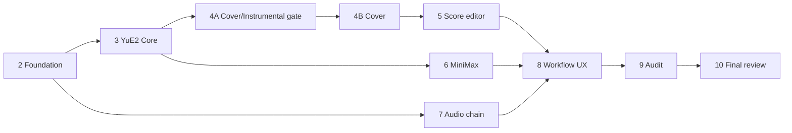

# Implementation Roadmap (package item Q)

| | |
|---|---|
| Status | Phase 1B design baseline — **no phase starts without explicit authorization** |
| Date | 2026-09-25 |
| Aligned with | the prompt set `Plenio_Music_Production_System_Refactor_Prompts/03…12` |
| Related | all documents in `docs/design/` |

The phases are **vertical slices**: each ends with something runnable in ComfyUI, with tests, documentation and an honest verification label ([testing-strategy.md](testing-strategy.md) §1). Evidence that disproves a design assumption is documented, the design document is updated, and the deviation is explained in the phase report.

---

## Before Phase 2 — owner decisions

Confirm or change D-01 … D-09 in [target-architecture.md](target-architecture.md) §0 (path templates, Apache-2.0, native LLM, ASR decision in 4A, optional separation, optional LoRA, clean break, English UI, package identity). Phase 2 records them as ADR-0001 … ADR-0009. Also re-confirm the two carried-over legacy decisions: instrumental as the default cover mode (2026-09-18, [yue2-cover-design.md](yue2-cover-design.md) §3) and no separation of delivered audio (2026-09-17, kept by D-05).

---

## Phase 2 — Foundation

| | |
|---|---|
| **Objective** | A clean, runnable package skeleton that implements the architecture's frame and retires the riskiest technical assumptions early. |
| **Scope** | Git repository in the sibling folder; `pyproject.toml` (+ `[tool.comfy]`), `requirements.txt`, LICENSE/NOTICE/THIRD_PARTY; `plenio.core` foundations (`errors`, `hashing`, `reports`, `config`, `sheet` state schema + resolver skeleton, `assets` catalogue loader + offline policy, `workers` protocol); `plenio.comfy` (`extension`, `types`, `host`, `routes` skeleton); **System Check** minimal node; frontend build pipeline (Vite/TS/Vue) with the extension entry and one trivial custom widget; `subgraphs/` and `example_workflows/` folders with validators; CI; docs skeleton (`docs/user`, `docs/dev`, `docs/adr`). |
| **Spikes (as tests)** | AS-02 custom widget via `widget_type` + `getCustomWidgets`, serialised and received by `execute`; AS-03 lazy inputs + `ExecutionBlocker` review gate + caching; AS-06 bypassed blocks skip validation of their loaders; AS-10 blueprints from `subgraphs/` appear in the node library. |
| **Prerequisites** | Phase 1 approved; decisions D-01 … D-09. |
| **Expected artifacts** | package skeleton; ADRs; CI workflow; spike results documented in `docs/design/` (updated assumptions register). |
| **Tests** | clean import; registration in a pinned ComfyUI (host test); import-boundary test; optional-dependency behaviour (missing module → actionable error); config loading; contract tests for report/sheet-state schemas; worker lifecycle with a fake worker (start, progress, cancel, timeout, crash); asset offline policy; template validator on a trivial template. |
| **Completion criteria** | Package loads in the user's ComfyUI 0.37 alongside the legacy toolkit (no ID collisions); System Check runs and shows hardware; all tests green on Windows and Linux CI; spike outcomes recorded; no reference to legacy IDs or paths. |
| **Effort** | **xhigh** |

## Phase 3 — YuE2 Core (YuE2 Song path)

| | |
|---|---|
| **Objective** | YuE2 as a first-class engine: from a brief to a finished FLAC with visible, editable, validated text and score. |
| **Scope** | Song Brief (+ template library, curated legacy templates); Engine Profile (YuE2 detection, tokenizer handle); Compose; Parse; Song Sheet with the **minimal dialog** (text documents, states, validation, approve); Score Tools operations (strip chords, voices, transpose, tempo, prepare-from-brief); Export Release **minimal** (FLAC 24-bit, naming, record); blueprints `YuE2 Model`, `Write Song`, `YuE2 Plan`, `YuE2 Render`, `Takes` (optional); template *YuE2 · Song* v0; `core.engines.yue2` (rules, exact budget, ceiling). |
| **Prerequisites** | Phase 2 complete. |
| **Expected artifacts** | nodes + blueprints + template; `/plenio/score/analyze`, `/plenio/score/transform`, `/plenio/lyrics/analyze`, `/plenio/sheet/resolve`, `/plenio/templates`; user doc *YuE2 Song*; node docs. |
| **Tests** | unit (score, lyrics, sheet, writing, engine rules), contract (schemas), workflow validation (template/blueprints), host integration (laziness: manual documents skip the LLM; conflicts stop; review gate; plan cached across takes; WYSIWYG: fake render receives exactly the sheet outputs), smoke S-1, S-2 (G1 part), S-6; studies AS-01 (writer model), AS-05 (ceiling), AS-04 (dynamic prompts), AS-14 (tokenizer structure). |
| **Completion criteria** | One-click song from brief to FLAC works on the user's GPU; stop-for-review works on both sheets; edited score survives new takes; changing the plan seed with an edited score stops with a conflict; record contains the exact conditioning; no YuE2-specific code outside `core.engines.yue2` and YuE2 blueprints. |
| **Effort** | **xhigh** |

## Phase 4A — YuE2 Cover and Instrumental design gate

| | |
|---|---|
| **Objective** | Replace remaining assumptions with measurements and freeze the cover/instrumental implementation specification. |
| **Scope** | Experiments Q-C1 … Q-C8 ([yue2-cover-design.md](yue2-cover-design.md) §15) and I-1 … I-6 ([instrumental-strategy.md](instrumental-strategy.md) §12); decisions: ASR engine and isolation mechanism, optional separation, detector and thresholds, LoRA status, lead-conversion policy, review defaults, render ceiling for covers, title/language handling. |
| **Prerequisites** | Phases 2–3; access to licensed/owned test songs; user availability for listening checks. |
| **Expected artifacts** | updated `yue2-cover-design.md` and `instrumental-strategy.md` (final data flow, precedence, modes, contracts, frontend implications, test matrix, failure modes, remaining assumptions); study data under `docs/test-reports/`. |
| **Tests** | study protocols with recorded data; spike tests for worker environments (venv and portable). |
| **Completion criteria** | every [AS] item of the cover/instrumental scope is either verified, rejected with evidence, or explicitly accepted as a documented limitation; implementation spec approved by the owner. |
| **Effort** | **max** |
| **Status** | **Done 2026-09-25** (study report `docs/test-reports/2026-09-25-phase-4a.md`). Not done, because they need downloads the owner has not approved: Qwen3-ASR comparison, isolated-environment spike (AS-11, not needed for the chosen engine). Listening verdicts: owner's listening pack. |

## Phase 4B — YuE2 Cover implementation

| | |
|---|---|
| **Objective** | Implement the approved cover specification and the instrumental strategy for both YuE2 paths. |
| **Scope** | Cover Brief; **Transcribe Score** node (`PlenioTranscribeScore`, beat grid → `PLENIO_TIMELINE`, source-length check against the SheetSage2 window/memory limit, out-of-memory handling) and blueprint; Score Tools cover preparation (vocals × harmony); Song Sheet `section_tags` output and `timeline` display input; Transcribe Lyrics (faster-whisper large-v3 worker with DLL-path handling and CPU fallback, deterministic settings, on-disk ASR cache, `core.lyrics.align` with the pickup rule, sung-lyrics check via `expected_lyrics`); Compose phrasing map for new lyrics; Check Vocals (`listen` + `score` detectors per instrumental-strategy §6.2, whole-take windows, list input, ranking, ending check); instrumental adapter: lazy CLIP switch in the cover template (on for instrumental covers), bypassed block on the Song path (instrumental-strategy §4.1, §10); Transcribe Lyrics over vocal regions only; instrumental plan length control on the Song path (Score Tools *fit length*, truncated-plan detection — instrumental-strategy §3.2); Takes block (AS-16); *YuE2 · Cover* template (both sheets *stop for review*); dialog extensions (ASR diff, low-confidence words, section table with times and play-section, conflict dialog); user doc *YuE2 Cover*, concept pages *Song Sheet* and *Instrumental*. |
| **Prerequisites** | Phase 4A approved by the owner. |
| **Expected artifacts** | nodes, worker, blueprints, template, docs. |
| **Tests** | the full cover matrix of yue2-cover-design §18 (modes × states × review × timeline × ASR × failures), `core.lyrics.align` unit tests (synthetic grids + recorded study data), contract tests (Transcribe Score ABC = native node, timeline bar count; worker on a short sung fixture), instrumental G1 guarantees on every path, detector/ranking tests, worker tests (crash, cancel, CPU fallback), smoke S-3, S-4 (+ instrumental cover run), WER on owner-supplied EN/DE songs (Q-C1b), verification labels per result. |
| **Completion criteria** | all five lyrics situations (automatic, corrected, fully manual, new, instrumental) behave exactly per the precedence tables; manual input is never overwritten; final lyrics and score are inspectable before generation; limitations documented. |
| **Effort** | **xhigh** |
| **Status** | **Done 2026-09-25** ([test report](../test-reports/2026-09-25-phase-4b.md)). Changes against the scope: Check Vocals uses the `score` detector only (owner calibration); the Takes loop starts with the final lyrics (a blocked loop hangs ComfyUI 0.37.0); new text-sheet checks for syllable fit and voice range and per-line syllable targets for new lyrics (real-run findings); ASR notes for the editor are stored by draft hash. Not built: play-section in the editor, WER on owner-supplied German songs (owner: not needed), Qwen3-ASR as an engine (evaluated, yue2-cover-design §21.3; **owner 2026-09-25: optional engine only**, built with the managed isolated environment in a later phase). |

## Phase 5 — Reusable score / ABC editor

| | |
|---|---|
| **Objective** | The polished notation editor inside the Song Sheet dialog. |
| **Scope** | abcjs notation view, CodeMirror ABC view, operation palette and shortcuts, navigator, lyrics-by-section panel, validation panel, playback with cursor and voice toggles, A/B with `reference_audio`, undo/redo, commit/approve semantics, accessibility and theming ([score-editor-design.md](score-editor-design.md)). |
| **Prerequisites** | Phases 3 and 4B (backend contracts and minimal dialog exist). |
| **Expected artifacts** | frontend modules and built output; editor user guide; developer notes for the frontend. |
| **Tests** | score-model/route unit tests, transform invariants, display normalisation and offset-map tests (accidental cases), Vitest store/history/mapping tests, e2e flows (open, edit, apply, save/reload, run, conflict, approval), YuE2 and cover integration tests. |
| **Completion criteria** | editing works on real SheetSage2 and YuE2 scores; no hidden stale copies; edits persist across save/reload; invalid edits are refused with bar-level feedback; the editor knows nothing about specific templates. |
| **Effort** | **xhigh** |
| **Status** | **Implemented; cloud-verifiable tests pass** (2026-09-25): backend element view, editing operations and routes, the tabbed editor with notation, ABC text, navigator, palette, undo/redo, playback and A/B; unit and Vitest suites pass, three defects they found are fixed; editor user guide and test report written ([../test-reports/2026-09-25-phase-5.md](../test-reports/2026-09-25-phase-5.md)). **Done** once the host tests, the browser checks (long YuE2 plan, keyboard-only, light theme) and the V3 runs pass on the owner's machine (report §5). |

## Phase 6 — MiniMax

| | |
|---|---|
| **Objective** | MiniMax Music 3 on the same architecture, with its own conditioning. |
| **Scope** | `core.engines.minimax` (structured caption rules, exact 5 000-token budget via tokenizer, instrumental conventions, ceiling ≤ 360 s); Engine Profile detection; blueprints `MiniMax Model`, `MiniMax Render`; *MiniMax · Song* template; instrumental caption wording (I-5). |
| **Prerequisites** | Phases 2–3 (can run in parallel with 4A–5 if resources allow). |
| **Expected artifacts** | engine module, blueprints, template, user doc. |
| **Tests** | rules/budget unit tests, blueprint/template validation, host tests (Song Sheet with caption documents), smoke S-5. |
| **Completion criteria** | MiniMax song from brief to FLAC; budget errors caught in the Song Sheet before render; no MiniMax-specific code outside its engine module and blueprints. |
| **Effort** | **high** |

## Phase 7 — Audio production chain

| | |
|---|---|
| **Objective** | Model-independent finishing: EQ, dynamics, loudness, formats, export. |
| **Scope** | EQ node (manual/match/tone target) + curve widget; Loudness & Dynamics node; presets route; Export Release full (FLAC/MP3/WAV via PyAV, tags + cover via mutagen, tag copy for Enhance); `Master` blueprint; *Enhance & Master* template; restoration gate: measure clipping/HF artefacts on YuE2/MiniMax takes and decide on the conditional Repair node (C1). |
| **Prerequisites** | Phase 2 (DSP is independent of engines); real takes from Phases 3/6 for the restoration measurement. |
| **Expected artifacts** | nodes, blueprint, template, presets, DSP documentation incl. limitations. |
| **Tests** | DSP regression suite (analytic responses, oracle loudness, true-peak at final rate, resampler specs), golden comparisons against legacy outputs (from a scratch copy), bypass identity, format/sample-rate tests, export matrix, smoke S-7. |
| **Completion criteria** | mastering hits stated targets within tolerances; bypassing a stage never changes format, metadata or sample rate unexpectedly; restoration decision documented with data. |
| **Effort** | **high** |

## Phase 8 — Main workflows, subgraphs and UX

| | |
|---|---|
| **Objective** | The finished user experience across all paths. |
| **Scope** | Final templates 0–4 with consistent anatomy, groups, titles, notes, thumbnails; promoted inputs reviewed; optional blocks labelled; `Cover Art` blueprint (FLUX.2 Klein 4B); App Mode configurations for the no-review paths (AS-13); System Check full (recommendation table); user guides (getting started, paths, concepts, models/downloads, licensing, troubleshooting); usability review and fixes. |
| **Prerequisites** | Phases 3–7. |
| **Expected artifacts** | templates, blueprint, App configs, documentation set. |
| **Tests** | template/App validation, save/reload of every template, full smoke pass (S-1…S-7), dependency-combination checks (optional blocks on/off), usability checklist results. |
| **Completion criteria** | a new user can choose the music model, make a song/cover, inspect and edit lyrics and score, and export — without seeing irrelevant controls; every parameter has one visible owner. |
| **Effort** | **xhigh** |

## Phase 9 — Full codebase audit

| | |
|---|---|
| **Objective** | Independent, adversarial audit of the complete system. |
| **Scope** | as defined in prompt 11 (architecture, code, frontend, APIs, nodes, subgraphs, workflows, engines, instrumental, editor, resources, dependencies, licensing, tests, docs, installation, error handling). |
| **Prerequisites** | Phase 8. |
| **Expected artifacts** | audit report under `docs/`; fixes for confirmed significant defects. |
| **Tests** | all suites re-run; new regression tests for every fixed defect. |
| **Completion criteria** | findings classified by severity/confidence; confirmed significant defects fixed or explicitly deferred with reasons. |
| **Effort** | **ultracode** |

## Phase 10 — Final architecture acceptance review

| | |
|---|---|
| **Objective** | Decide whether the system is a clean, maintainable architecture another maintainer would accept. |
| **Scope** | as defined in prompt 12. |
| **Prerequisites** | Phase 9. |
| **Expected artifacts** | acceptance report with verdict, remaining limitations, extension points. |
| **Tests** | actual test results referenced; no new speculative work. |
| **Completion criteria** | verdict based on concrete evidence. |
| **Effort** | **max** |

---

## Dependency overview

The prompt set runs the phases in numerical order; Phases 6 and 7 could be started earlier (dotted dependencies above) if parallel work is wanted.

## Definition of done (every phase)

- Tests for the new behaviour exist and pass; verification level stated honestly.
- User and developer documentation updated; node docs and tooltips complete.
- Design documents updated where evidence changed them; deviations explained.
- No hard-coded local paths; no legacy IDs; no silent fallbacks.
- The package still loads and the existing templates still validate.
