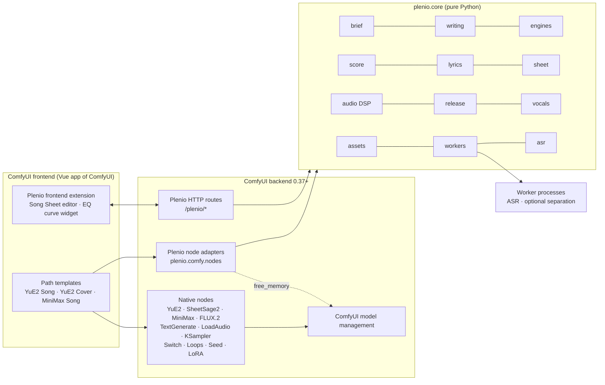

# Plenio Music Production System — Target Architecture

| | |
|---|---|
| Phase | 1B — architecture and implementation design (no production code) |
| Status | **Design baseline, waiting for implementation authorization** |
| Date | 2026-09-25 |
| Inputs | [current-system-analysis.md](current-system-analysis.md) (Phase 1A), host ComfyUI 0.37.0 / frontend 1.53.6, upstream sources listed there |
| Companion documents | [migration-map.md](migration-map.md) · [yue2-design.md](yue2-design.md) · [yue2-cover-design.md](yue2-cover-design.md) · [instrumental-strategy.md](instrumental-strategy.md) · [score-editor-design.md](score-editor-design.md) · [testing-strategy.md](testing-strategy.md) · [implementation-roadmap.md](implementation-roadmap.md) |

This document covers the Phase 1B package items **A** (target architecture), **B** (repository structure), **D** (custom nodes), **E** (subgraphs), **F** (main workflow UX), **G** (model/backend architecture), **L** (resource management), **M** (dependencies and licensing), **O** (documentation), **P** (migration strategy) and the **critical design review**. Items C, H, I, J, K, N and Q have their own documents.

Evidence tags are the same as in Phase 1A: **[VF]** verified fact, **[UP]** upstream documented, **[CM]** community evidence, **[EA]** engineering assessment, **[AS]** assumption to validate. Assumptions are collected in §18 and scheduled in the roadmap.

---

## 0. Decisions that need the owner's confirmation

These decisions shape everything else. The design below implements the recommendation; the alternative is described so that it can be chosen instead.

| ID | Decision | Recommendation (this design) | Alternative | Why |
|---|---|---|---|---|
| **D-01** | How the first decision "Music Model" is presented | One **path template** per model — *1 · YuE2 · Song*, *2 · YuE2 · Cover*, *3 · MiniMax · Song* (+ *4 · Enhance & Master*, *0 · System Check*), listed in the Template Browser under the package (ComfyUI groups custom-node templates by the install folder name, e.g. `comfyui-plenio-music` [VF Phase 2]). The user picks the model when opening Plenio (Template Browser / App). All paths share the same nodes and subgraphs and the same layout. | One mega-workflow with a model dropdown and lazy multiplexers for every engine-dependent block. | The per-path graph contains only what the path needs, so no irrelevant control exists at all (no hiding machinery). A mega-workflow re-creates the legacy TP-01 problem, needs three-way switches in every block, and must be edited in every block to add a model. See §17 C-01. |
| **D-02** | Licence of the new package | **Apache-2.0** | MIT (legacy) | Patent grant; same licence as YuE2 code, the vendored upstream ABC tools and the community YuE2 node pack, so reuse is simple. |
| **D-03** | Local LLM runtime | **Native `TextGenerate`** with ComfyUI-format text models (Qwen 3.5, Gemma 4), inside ComfyUI's model management. Remote/other LLMs by swapping that one node. | Keep a llama.cpp GGUF node. | Removes the co-residency hacks (Phase 1A TP-16/LF-1). [VF] native text models exist (Comfy-Org/Qwen3.5 2B/4B/9B, Comfy-Org/gemma-4 E2B/E4B/12B incl. int8). Quality vs. GGUF on 16 GB is [AS] (Phase 3 check). |
| **D-04** | Default lyrics ASR engine | Decided in **Phase 4A by measurement** between faster-whisper (in-host dependencies, crash-isolated worker) and Qwen3-ASR (upstream-recommended, but pins `transformers==4.57.6` vs host 5.5.4 [VF], so only in an isolated worker environment). | — | Upstream recommends Qwen3-ASR [UP]; installation cost and quality on the user's material decide. |
| **D-05** | Vocal separation | **Optional**, only for ASR pre-processing and output validation. The delivered audio is never processed by separation unless the user explicitly enables a separate "vocal removal" fallback. | No separation at all (legacy decision of 2026-09-17). | Improves ASR and validation without touching the music; the legacy decision concerned the output. |
| **D-06** | Instrumental LoRA | **Optional adapter block, bypassed by default** until Phase 4A verifies key mapping, quality and licence acceptance (CC BY-NC 4.0). | On by default. | Existence verified [VF]; runtime compatibility [AS]; community maintenance [CM]. |
| **D-07** | Legacy compatibility | **Clean break**: new package ID, new node IDs, no node-replacement mappings for legacy IDs. Content (prompt library, presets, DSP algorithms, lessons) is migrated deliberately. | Provide `io.NodeReplace` mappings for legacy nodes. | Legacy nodes have no 1:1 successors; a replacement layer would re-import legacy semantics. Legacy and Plenio can be installed side by side (no ID collisions). |
| **D-08** | UI language | **English UI**; optional German user guide. | German UI | ComfyUI's locale list for custom nodes has no German (`en, zh, zh-TW, fr, ko, ru, es, ja, ar`) [UP]. |
| **D-09** | Package identity | Registry package `comfyui-plenio-music`, display name *Plenio Music Production System*, publisher `jplenio`, node IDs prefixed `Plenio`, categories `Plenio/…`. | — | Unambiguous, no collision with legacy `MiniMax*`/`Music*` IDs. |

**Phase 4A outcomes (2026-09-25, study report `docs/test-reports/2026-09-25-phase-4a.md`):** D-04 → **faster-whisper large-v3** (worker process of the host Python, VAD off, deterministic settings, on-disk cache); Qwen3-ASR not measured (download not approved). D-05 → separation **not built** in 4B (no measured ASR gain on the test material); delivered audio is never separated (owner, 2026-09-25). D-06 → adapter **stays bypassed by default**: keys load completely and plans lose their vocal melody, but text-path renders got very long plans and abrupt endings. The owner confirmed on 2026-09-25 that covers default to *instrumental*.

---

## 1. Goals and non-goals

**Goals** (from the Phase 1B brief): simplicity; reusable components; a minimal number of custom nodes; native ComfyUI functionality wherever suitable; sensible use of subgraphs ("simple outside, transparent inside"); clean backend/frontend separation; excellent UX with only relevant controls; model-independent reusable components; clear parameter ownership; testability; robust resource handling; extensibility.

**Non-goals**

- No own inference implementations of YuE2, SheetSage2, MiniMax Music 3, FLUX.2 or LLMs — ComfyUI core provides them [VF].
- No DAW. The score editor is a polished notation/ABC editor with a path to a piano-roll view later.
- No model training, no multi-user service, no cloud features.
- No LLM provider SDKs or API-key storage in Plenio; remote LLMs are used by swapping the text-generation node.
- No bundling of code without a clear licence (FlashSR vendoring ends).

---

## 2. Architectural rules (binding for all phases)

| Rule | Statement | Consequence |
|---|---|---|
| **R1 Native first** | If a ComfyUI core node or mechanism solves a need, use it. | Generation, transcription, loaders, LoRA, seeds, previews, switches, loops, downloads, templates, blueprints are native. |
| **R2 One owner per setting** | Every user-facing value has exactly one owning node. Other nodes receive it by wire. | No duplicated widgets, no "central settings" copies. |
| **R3 Links win** | A connected input overrides the widget of the same input (native ComfyUI semantics). Plenio never merges payloads into widgets field by field. | Precedence is visible in the graph. |
| **R4 Manual text wins** | In the Song Sheet, a document is `auto`, `edited` or `manual`. Manual beats edited beats automatic. An edited document whose upstream changed stops the run with a conflict — never a silent replacement. | Satisfies "ASR/LLM must never silently override manual lyrics". |
| **R5 WYSIWYG after the Song Sheet** | Style, lyrics and score leave the Song Sheet unchanged and reach the native generation node verbatim. | "The exact lyrics and score used" are the ones shown and recorded. |
| **R6 Visible transformations** | Deterministic transformations (strip chords, voice conversion, transpose, tempo) are explicit nodes before the Song Sheet and report what changed. | No hidden rewrites in generation nodes. |
| **R7 No silent degradation** | A missing optional dependency, model or asset produces an actionable error or an explicit, visible *skipped* state in the node UI and report. No pass-through on failure. | Replaces the legacy warn-and-continue pattern (TP-23). |
| **R8 Engine rules follow the loaded model** | Engine-specific rules come from the `ENGINE` descriptor produced next to the model loader, which also verifies the loaded model. | No repeated model selection; no fake choices. |
| **R9 ComfyUI owns GPU memory** | In-process models go through ComfyUI's model management. Out-of-process workers request room via the public `free_memory` API before they start. No access to private allocator internals. | Removes TP-16. |
| **R10 Pure core** | `plenio.core` imports nothing from ComfyUI and is fully testable without it (enforced by a test). ComfyUI code (GPL-3.0 [VF]) is never copied into Plenio. | Testability; licence hygiene. |
| **R11 Documented frontend APIs only** | Extensions use `registerExtension` hooks, `getCustomWidgets`, `addWidget`/`addDOMWidget`, widget values, `node.properties`, documented dialog/toast/settings/command APIs. No monkey-patching of internal stores or unpublished globals. | Survives frontend updates (Phase 1A §13 migration notes). |
| **R12 Deterministic defaults** | Draft (LLM) and plan (ABC) seeds are fixed by default; the take seed is randomized after each run. | Re-running makes a new take while the text and score stay cached and valid. |

---

## 3. System overview



- The **graph** (templates + blueprints) is the orchestration layer. There is no Plenio orchestration engine.
- **Plenio nodes** are thin adapters: they validate inputs, call `plenio.core`, and return typed outputs, UI payloads and reports.
- The **frontend extension** only edits documents and displays results; all musical truth (validation, analysis, transformations) is computed by the backend through routes that call the same core functions as the nodes.

---

## 4. Layers and modules (A)

### 4.1 `plenio.core` — pure domain library

| Module | Responsibility | Key public functions / types |
|---|---|---|
| `core.errors` | Error taxonomy with actionable messages | `PlenioUserError`, `PlenioConflictError`, `PlenioDependencyError`, `PlenioModelError`, `PlenioValidationError`, `PlenioAssetError`, `PlenioWorkerError`, `PlenioCancelledError` (added in Phase 2 for assets and workers) |
| `core.hashing` | Canonical JSON + SHA-256 for documents and fingerprints | `canonical_json()`, `sha256_text()` |
| `core.reports` | Report records (`plenio.report/1`) | `Report`, `Status` |
| `core.config` | Small configuration: env vars and an optional `user/plenio/config.toml` (offline mode, asset directory, worker defaults) | `PlenioConfig.load()` |
| `core.brief` | Brief model, template library (Markdown with front matter), validation | `SongBrief`, `CoverBrief`, `TemplateLibrary` |
| `core.engines.yue2`, `core.engines.minimax` | Engine profiles and rules: document formats, style/caption rules, instrumental conventions, token/context budgets, default render parameters, duration ceilings | `profile()`, `writing_rules()`, `validate_documents()`, `budget()` |
| `core.writing` | Prompt composition from brief + engine rules + context; draft parsing and deterministic format enforcement | `compose()`, `parse_draft()` |
| `core.score` | Native two-voice ABC dialect: parse/validate (vendored upstream parser), analysis (timeline, sections, voices, bars), deterministic operations, display normalisation, comparison | `analyze()`, `validate()`, `strip_chords()`, `convert_voices()`, `transpose()`, `set_tempo()`, `display_abc()`, `compare()` |
| `core.lyrics` | Sectioned lyrics model, timed transcripts, alignment of timed words into score sections (lossless order check), syllable-fit analysis | `SectionedLyrics`, `TimedTranscript`, `align_to_sections()`, `fit_report()` |
| `core.sheet` | Song Sheet documents, edit states, conflict detection, approval fingerprints | `SheetState`, `resolve()`, `fingerprint()` |
| `core.asr` | Transcript contract and worker clients for ASR engines | `transcribe()` (engine adapters) |
| `core.vocals` | Vocal-presence metrics from score transcription, stems or ASR; take ranking | `vocal_activity()`, `rank_takes()` |
| `core.audio` | DSP: parametric EQ, auto-EQ fit, compressor, true-peak limiter, BS.1770 loudness, resampling, analysis (and gated repair algorithms) | `apply_eq()`, `fit_eq()`, `master()`, `loudness()`, `resample()` |
| `core.release` | Naming patterns, tag model, encoding (PyAV adapter), tag/cover writing (mutagen adapter), release record, atomic writes, secret redaction | `plan_release()`, `write_release()`, `Record` |
| `core.assets` | Catalogue of non-ComfyUI assets (pinned repo, revision, files, size, licence), fetch with resume, offline policy | `ensure_asset()` |
| `core.workers` | Subprocess protocol (request/progress/result files), cancellation, time limits, isolated environments | `run_worker()`, `WorkerEnv` |
| `core.dependencies` *(Phase 2)* | Probing optional packages and raising actionable dependency errors | `probe()`, `require()` |
| `core.system` *(Phase 2)* | System Check facts, report and recommendation rules | `check_system()` |
| `core.files` *(Phase 2)* | TOML reading, atomic writes | `read_toml()`, `atomic_write_text()` |
| `third_party/yue2_abc_tools.py` | Unchanged upstream `abc_tools.py` (Apache-2.0, pinned commit) | parser, `strip_chords`, `compare` |

### 4.2 `plenio.comfy` — ComfyUI adapter layer

| Module | Responsibility |
|---|---|
| `comfy.extension` | `ComfyExtension` + `comfy_entrypoint()`: node list, route registration, folder registration (`models/plenio/...`), capability report in the log |
| `comfy.types` | Custom IO types (§5.1) |
| `comfy.nodes.*` | One module per node (§8). Each node: V3 schema, tooltips, `validate_inputs`, `check_lazy_status` where lazy, `execute` delegating to core |
| `comfy.routes` | `/plenio/*` HTTP endpoints for the editor, templates, presets and diagnostics (§6) |
| `comfy.host` | The **only** module that touches `comfy.model_management` / `folder_paths` / progress / interrupt APIs; wraps them for the nodes |

### 4.3 Frontend (`frontend/` sources → `web/` build output)

| Part | Responsibility |
|---|---|
| Extension entry | Registers the Plenio extension, custom widgets (`getCustomWidgets`), node summaries, commands |
| Song Sheet editor | Modal editor for title, style/caption, lyrics, score (notation + ABC text + playback), validation and approval (see [score-editor-design.md](score-editor-design.md)) |
| EQ curve widget | Response curve and band handles for `PlenioEQ` (Phase 7) |
| API client | Typed calls to `/plenio/*` |

### 4.4 Graph assets

| Asset | Location | Role |
|---|---|---|
| Subgraph blueprints | `subgraphs/*.json` | Reusable engine and production blocks, served by ComfyUI via `/global_subgraphs` [VF] |
| Path templates | `example_workflows/*.json` (+ `.jpg`) | The user entry points shown in the Template Browser [VF] |
| Resources | `resources/` | Template library, writing rule texts, EQ/loudness presets, asset catalogue |

Dependency direction: `frontend → routes → core`, `nodes → core`, `nodes → host → ComfyUI`, never `core → comfy`.

---

## 5. Data contracts (A)

### 5.1 Custom IO types (all versioned; objects are Python dataclasses, JSON-serialisable for reports and records)

| Type | Produced by | Consumed by | Content |
|---|---|---|---|
| `PLENIO_BRIEF` | Song Brief, Cover Brief | Compose, Score Tools, Song Sheet, Check Vocals, Export | `schema`, `kind` (`song`/`cover`), template reference, description, genre, mood, tempo, key, meter, length target (songs), `vocals` (see [yue2-cover-design.md](yue2-cover-design.md) §3 and [instrumental-strategy.md](instrumental-strategy.md)), `harmony` (covers), fingerprint |
| `PLENIO_ENGINE` | Engine Profile node (inside the model blueprints) | Compose, Song Sheet, Export | `engine_id` (`yue2`, `minimax_music3`), rules version, capabilities (score support, planning modes, max seconds, prompt token limit, context tokens, frame rate), a non-serialised tokenizer handle for exact counting, model identity for the record |
| `PLENIO_REQUEST` | Compose Writing Prompt | Parse Song Draft | engine id, brief fingerprint, expected sections, vocal mode, format rules (style word limit, tag vocabulary, token budget), score context summary |
| `PLENIO_REPORT` | every Plenio node that has something to record | Export (Autogrow input), other reports | `schema: plenio.report/1`, source node type/id, kind, status (`ok`/`warning`/`error`/`skipped`), summary, data |
| `PLENIO_TIMELINE` (Phase 4A) | Transcribe Score | Transcribe Lyrics, Song Sheet (display), Export | `schema: plenio.timeline/1`: source audio hash, hash of the transcription it belongs to, bar start/end times and meters in source seconds (SheetSage2 beat grid), first beat, pickup padding, tempo, sections — [yue2-cover-design.md](yue2-cover-design.md) §15.2 |

Standard types are used everywhere else: `STRING` for documents, `AUDIO`, `IMAGE`, `CLIP`/`MODEL`/`VAE`, `AUDIO_ENCODER`, `COMBO` (planning mode output), `FLOAT`, `INT`, `BOOLEAN`. No JSON-in-STRING interfaces (legacy TP-02).

### 5.2 Document formats

| Document | Format | Rules owner |
|---|---|---|
| Title | single line | core.release (filename-safe variant derived at export) |
| Style (YuE2) / Caption (MiniMax) | plain text | `core.engines.<engine>` |
| Lyrics | sectioned text: `[Tag]` on its own line, sung lines beneath, blank line between sections | `core.lyrics` (+ engine tag vocabulary) |
| Score | ABC in the **native two-voice dialect** (`yue2-native`): header `X,T,M,L,Q,V,V,K`, voices `Vocal`/`Ins`, 1–4 bar groups with `% section` comments, no `w:` lines | `core.score` (upstream parser authoritative) |
| Artwork prompt | plain text | core.writing |

### 5.3 `SheetState` (the Song Sheet's persisted state, one widget value)

```json
{
  "schema": "plenio.sheet_state/1",
  "docs": {
    "lyrics": {"state": "edited", "text": "...", "base_sha256": "<hash of the upstream text the edit was made from>"},
    "score":  {"state": "auto"},
    "style":  {"state": "manual", "text": "..."}
  },
  "review": {"approved_fingerprint": "<fingerprint of the resolved documents the user approved>"}
}
```

Resolution per document (implemented once in `core.sheet.resolve`, used by the node and by the editor route):

| State | Upstream input evaluated? | Output | Upstream changed since edit |
|---|---|---|---|
| `auto` | yes | upstream text | — |
| `edited` | yes | edited text | **conflict → run stops** with an explanation; the editor offers *keep my edit (make manual)*, *discard edit*, *compare & rebase* |
| `manual` | **no** (lazy input not requested) | manual text | irrelevant |

### 5.4 Release record (`plenio.record/1`)

Written by Export Release next to the audio: Plenio/ComfyUI/frontend versions, engine and model identities, the executed graph (hidden `prompt`, with secret-like fields redacted), the resolved documents with hashes and states, seeds, all reports received, output files with sizes and hashes, loudness/format facts, licence notices of the models used (e.g. CC BY-NC for YuE2). One schema, migrations only by explicit versioned functions.

### 5.5 Versioning

Every schema string carries a major version. Readers accept the current and previous major version; writers write the current one. Contract tests pin the schemas (see [testing-strategy.md](testing-strategy.md)).

---

## 6. Backend/frontend boundary (A)

The frontend never decides musical validity. It calls these routes (all JSON, all pure functions over core):

| Route | Purpose |
|---|---|
| `POST /plenio/score/analyze` | ABC → diagnostics (line/column/severity), timeline (tempo, meter, key, bars, sections with bar and second positions), voice summaries, note events for later piano-roll use, display ABC with explicit accidentals and an offset map |
| `POST /plenio/score/transform` | ABC + operation (+ selection) → new ABC + diagnostics + change list (same functions as Score Tools) |
| `POST /plenio/lyrics/analyze` | lyrics (+ score) → sections, tag consistency with the score, syllable-fit per section |
| `POST /plenio/sheet/resolve` | SheetState + last upstream documents → resolved documents, conflicts, validation, **fingerprint** (used for approval, so no hashing logic is duplicated in TypeScript) |
| `GET /plenio/templates`, `GET /plenio/templates/{id}`, `POST /plenio/templates` | template library listing, loading, saving user templates into the ComfyUI **user** directory (never into the package) |
| `GET /plenio/presets/{kind}` | EQ and loudness presets (single source for backend and frontend) |
| `GET /plenio/system` | diagnostics for the System Check node and troubleshooting |

Node → frontend: each node returns a small UI payload (`NodeOutput(ui=…)`) with the documents it saw, their hashes, validation results and status. Frontend → node: only widget values (the Song Sheet's `sheet_state`, EQ bands); nothing else is written into the graph by the frontend.

---

## 7. Model/backend architecture (G)

### 7.1 Principle: engines are rules plus graphs, not a common API

Generation stays in native nodes. What differs between engines is captured in two places:

1. **Engine rules module** (`core.engines.yue2`, `core.engines.minimax`): document formats, style/caption rules, instrumental conventions, budgets, duration ceilings, default render parameters, validation. Plain functions over plain data — no plugin registry, no abstract base class.
2. **Engine blueprints**: `Plenio · <Engine> Model` (loaders + optional adapter + Engine Profile) and `Plenio · <Engine> Render` (native generation nodes). Each engine keeps its own inputs: YuE2 render takes `style`, `lyrics`, `score`, `planning mode`; MiniMax render takes `caption` and `lyrics`. Nothing is forced into a lowest-common-denominator interface.

The shared, model-independent nodes (Brief, Compose, Parse, Song Sheet, Score Tools, Transcribe Lyrics, Check Vocals, EQ, Loudness, Export) adapt through the `PLENIO_ENGINE` wire or simply do not care (DSP, export).

### 7.2 Engine matrix

| Capability | YuE2 | YuE2 Cover | MiniMax Music 3 |
|---|---|---|---|
| Conditioning documents | style (short tags), lyrics, score (ABC), planning mode | same, score from SheetSage2 | caption (structured), lyrics |
| Score | planned by `YuE2GenerateABC` (full/melody) or off | transcribed by `SheetSage2AudioToABC` (always full), prepared by Score Tools | none |
| Render | `YuE2GenerateMusic` → `EmptyYuE2LatentAudio` → `KSampler` (32, dpm_2, sgm_uniform, cfg 1) → `VAEDecodeAudio` [VF] | same | `MiniMaxMusic3TextEncode` → `EmptyMiniMaxMusic3LatentAudio` → `KSampler` (30, euler, simple, cfg 1.7) → `VAEDecodeAudio(Tiled)` [VF] |
| Text limits | 24 576-token context shared with ABC and music (25 frames/s) [VF] | same | 5 000 prompt tokens (native error), 9 000 frames = 360 s [VF] |
| Instrumental mechanisms | tags-only lyrics, silent Vocal voice, optional AR LoRA | same + lead/accompaniment conversion | `[Instrumental]`/`[Solo]` tags [UP], caption |
| Weights licence | CC BY-NC 4.0 [VF] | CC BY-NC 4.0 (YuE2 + SheetSage2) | MiniMax-Music3 Community License [VF] |

### 7.3 Adding a backend (extension checklist)

1. `core.engines.<new>`: profile, rules, validation, budget (tests with fixtures).
2. Engine Profile detection for its CLIP/tokenizer class (adapter, tested against the pinned ComfyUI version).
3. Blueprints `Plenio · <New> Model` and `Plenio · <New> Render` using the new native nodes.
4. A path template.
5. Documentation page and smoke test.

No shared node needs to change unless the new engine introduces a new *document type*.

---

## 8. Minimal custom-node inventory (D)

Fourteen core nodes (legacy: 55; #14 added by the Phase 4A design gate). Two further nodes are conditional on measurements. Every node exists because ComfyUI has no equivalent and because it is reusable beyond one template.

| # | Node (ID) | Category | Phase | Reused by | Why it must exist |
|---|---|---|---|---|---|
| 1 | **Song Brief** `PlenioSongBrief` | Plenio/Song | 3 | YuE2 Song, MiniMax Song | Structured intent with template library; the **single owner** of vocal mode (sung/instrumental), length target and style fields. Native primitives cannot prefill from templates or enforce the structure. |
| 2 | **Cover Brief** `PlenioCoverBrief` | Plenio/Song | 4B | YuE2 Cover (any future cover engine) | Cover intent: target style, vocal handling (original lyrics / new lyrics / instrumental lead / accompaniment only) and harmony (keep/new). Separate from Song Brief so that neither shows options that do not apply. |
| 3 | **Engine Profile** `PlenioEngine` | Plenio/Model | 3 | inside every Model blueprint | Detects and verifies the loaded music model from its `CLIP`, emits `PLENIO_ENGINE` (rules + exact tokenizer handle). Makes engine rules follow the actual model (R8) and prevents repeated model selection. |
| 4 | **Compose Writing Prompt** `PlenioComposePrompt` | Plenio/Writing | 3 | Write Song blueprint (all paths) | Engine-specific writing rules (YuE2 concise style tags, MiniMax structured caption, instrumental rules, cover phrasing context) → plain `STRING` prompt for **any** LLM node. |
| 5 | **Parse Song Draft** `PlenioParseDraft` | Plenio/Writing | 3 | Write Song blueprint | Robust section parsing of LLM output, deterministic format enforcement (reported, never silent), instrumental tags from score sections. |
| 6 | **Song Sheet** `PlenioSongSheet` | Plenio/Song | 3 (text UI), 5 (notation editor) | every path | The single authoritative, inspectable, manually overridable point for the documents that condition generation; validation; optional review gate. No native equivalent. |
| 7 | **Score Tools** `PlenioScoreTools` | Plenio/Score | 3, 4B | YuE2 Song, YuE2 Cover, any ABC workflow | Deterministic, validated operations on native two-voice ABC (strip chords, voice conversion, transpose, tempo, "prepare from brief"). |
| 8 | **Transcribe Lyrics** `PlenioTranscribeLyrics` | Plenio/Audio analysis | 4B | YuE2 Cover, sung-lyrics check of any sung take | ASR (faster-whisper large-v3, D-04) in a worker process with word timestamps, alignment to the final score's sections on the beat grid, optional comparison with expected lyrics. ComfyUI has no ASR node [VF]. |
| 9 | **Check Vocals** `PlenioVocalCheck` | Plenio/Audio analysis | 4B | instrumental takes of every engine | Vocal-presence validation and best-take selection over one or many takes (list input from native loops). |
| 10 | **EQ** `PlenioEQ` | Plenio/Mastering | 7 | any audio | Parametric EQ with manual, reference-match and tone-target modes (legacy Auto-EQ merged in). Native EQ is 3-band only [VF]. |
| 11 | **Loudness & Dynamics** `PlenioLoudness` | Plenio/Mastering | 7 | any audio | Optional compression, true-peak limiting, BS.1770 loudness target, explicit output sample rate. No native equivalent. |
| 12 | **Export Release** `PlenioExportRelease` | Plenio/Release | 3 (minimal), 7 (full) | every path | Release package: naming, formats (via PyAV), tags and cover (mutagen), release record from the executed graph + reports. Native save nodes write `prefix_00001` names without tags/cover/record [VF]. |
| 13 | **System Check** `PlenioSystemCheck` | Plenio/Utilities | 2 (minimal), 8 | System Check template | Diagnostics: GPU/VRAM, installed models/assets/engines, transparent recommendations (never auto-applied). |
| 14 | **Transcribe Score** `PlenioTranscribeScore` | Plenio/Audio analysis | 4B | YuE2 Cover, any audio-to-score need | Runs the native SheetSage2 encoder and native `events_to_abc` (ABC identical to `SheetSage2AudioToABC`, full mode) and also returns the decoded beat grid (`PLENIO_TIMELINE`), which the native node discards but lyrics alignment needs [4A E1]. Inside the *Transcribe Score* blueprint. |
| C1 | *Audio Repair* `PlenioRepair` (conditional) | Plenio/Mastering | 7 gate | any audio | Only if measurement on YuE2/MiniMax output shows benefit (declip, HF de-harsh, spectral cleanup, filter as operations of one node). |
| C2 | *Separate Vocals* `PlenioSeparateVocals` (conditional) | Plenio/Audio analysis | 4A gate → **not built in 4B** | ASR pre-processing, validation | Phase 4A: ASR on the full mix reached ~1 % WER on a produced pop song, so separation brings no measured gain yet; revisit with dense mixes (Q-C1b). |

**Deliberately not built** (native or unnecessary): model selector/control nodes, settings nodes, sampler wrappers, safe decoders, stage gates, branch selectors, preview gates, output-path nodes, square-size helpers, LLM chat/unload/session nodes, LLM settings, model downloader/autodownload/advisor nodes, prompt report node, per-artefact savers, production-JSON node with dozens of sockets, style-hint node, instrumental pick node, cover-studio nodes.

Per-node specifications (inputs, outputs, normal vs advanced widgets, lazy behaviour, errors) are in §8.1.

### 8.1 Node specifications

Notation: **N** normal widget, **A** advanced widget (`advanced=True`), **S** socket, **L** lazy input, **DC** DynamicCombo.

**1 · Song Brief** — outputs `brief` (PLENIO_BRIEF), `brief_text` (STRING, human-readable), `max_seconds` (FLOAT, from the length target), `instrumental` (BOOLEAN)

*Phase 3:* the template rule is "empty text fields take the template's value" (the same headless and in the editor); combos (length, vocals) always have a value and therefore stay the user's choice. ComfyUI passes all inputs (incl. DynamicCombo values) to `validate_inputs`, so the node checks its combos itself.

| Input | Kind | Notes |
|---|---|---|
| template | N combo (grouped library) | `none` = free brief; selection prefills the fields in the frontend and is also resolvable headless |
| description | N multiline | free text |
| genre, mood, tempo, length | N | curated options + free text |
| key, meter | A | optional musical constraints |
| vocals | N DC | `sung` (default) → language, voice character, lyrics theme · `instrumental` → melody: *instrument plays the lead* / *accompaniment only*, optional lead instrument |

**2 · Cover Brief** — outputs `brief`, `brief_text`, `use_source_lyrics` (BOOLEAN), `instrumental` (BOOLEAN)

| Input | Kind | Notes |
|---|---|---|
| template, description, genre, mood | N | the **target** style |
| vocals | N DC | `original lyrics` → language hint (auto) · `new lyrics` → language, theme, source transcript as phrasing reference (off) · `instrumental` (default: *instrument plays the vocal melody*; owner decision of 2026-09-18, re-confirmed 2026-09-25) → *instrument plays the vocal melody* / *accompaniment only*, optional lead instrument |
| harmony | N | *new accompaniment* (default) / *keep original chords*; *accompaniment only* + *new accompaniment* shows a warning (almost nothing of the source remains, Phase 4A) |

**3 · Engine Profile** — input `clip` (S). Output `engine`. Raises `PlenioModelError` if the CLIP is not a supported engine. No widgets.

**4 · Compose Writing Prompt** — inputs `brief` (S), `engine` (S), `score` (S, optional: cover/new-lyrics phrasing context), `reference_lyrics` (S, optional, L: source transcript as phrasing reference), `language` (S, optional, L: detected source language, requested only for original-lyrics covers whose brief says *auto*); widget `detail` (A: concise/standard/rich). A fixed title from the Cover Brief is passed through the request instead of being invented. Outputs `prompt` (STRING), `request` (PLENIO_REQUEST).

**5 · Parse Song Draft** — inputs `text` (S, from any LLM node), `request` (S), `score` (S, optional: tags for instrumental, section count check). Outputs `title`, `style`, `lyrics`, `artwork_prompt` (STRING), `report`. Enforcement changes (e.g. words removed from instrumental lyrics) are listed in the report and shown on the node.

*Phase 3:* the writer is asked for labelled blocks (`TITLE:`, `STYLE:`, `LYRICS:`, `ARTWORK:`); unlabelled or partly labelled answers are inferred from the layout and reported. The optional `score` input is not needed by the YuE2 Song path and was not implemented; instrumental tags come from the request's section plan.

**6 · Song Sheet** — inputs (all optional, **all L**): `title`, `style`, `lyrics`, `score`, `artwork_prompt`; display-only context: `context_lyrics`, `context_style`, `reference_audio` (for A/B listening in the editor); rules: `brief` (S), `engine` (S). Widgets: `review` (N: *continue* / *stop for review*), `sheet_state` (custom editor widget). Outputs: `title`, `style`, `lyrics`, `score`, `artwork_prompt`, `planning_mode` (COMBO `full`/`melody`, derived from the final score), `score_seconds` (FLOAT, render ceiling derived from the final score), `report`. Output node, so it can be run alone ("Queue Selected Output Nodes" [VF]). Review gate: when *stop for review* is set and the resolved documents' fingerprint differs from the approved one, the document outputs are `ExecutionBlocker`s [VF] and the node shows "waiting for approval". Details: [score-editor-design.md](score-editor-design.md), [yue2-cover-design.md](yue2-cover-design.md) §4.

**7 · Score Tools** — input `score` (S), `brief` (S, optional); widget `operation` (N DC): `prepare from brief` · `strip chords` · `voices` (Vocal: keep / mute / move to Ins with conflict policy) · `transpose` (semitones) · `tempo` (BPM or %). Outputs `score`, `section_tags` (STRING), `report`. Every operation is validated with the upstream parser and reports its invariants.

*Phase 4A:* the score instance of the sheet additionally outputs `section_tags` (the final score's section tags, the lyrics draft of instrumental covers) and takes the transcription `timeline` as a display input (section times, play-section of the reference audio).

**8 · Transcribe Lyrics** — inputs `audio` (S), `score` (S, optional: the final score, align to its sections), `timeline` (S, optional: the transcription's beat grid), `expected_lyrics` (S, optional: turns on the sung-lyrics check — WER overall and per section); widgets `language` (N: auto or explicit), `device` (A: auto/cuda/cpu); an `engine` widget appears only once a second engine exists. Outputs `lyrics` (sectioned draft if a score is given), `transcript` (plain text), `language` (detected), `report` (timestamps, per-section words, low-confidence words, alignment method and fallbacks, cache hit, check result).

*Phase 4A decisions* ([yue2-cover-design.md](yue2-cover-design.md) §10): faster-whisper large-v3 in a worker subprocess of the host Python, VAD off, beam 5, `temperature=0`, word timestamps; results cached on disk by source hash + engine + model revision + settings, so a ComfyUI restart reproduces the same draft (an edited lyrics document stays valid); alignment on the beat grid with the pickup rule; no separation.

**14 · Transcribe Score** — inputs `audio_encoder` (S, SheetSage2), `audio` (S). Outputs `score` (STRING, native full-mode ABC, byte-identical to `SheetSage2AudioToABC(mode=full)`), `timeline` (PLENIO_TIMELINE), `report` (bars, tempo, meters, keys, sections with times, notes per voice, pickup padding). The host adapter mirrors the native `generate_abc` for one item, keeps the decoded events and builds the timeline with the native `infer_measures`; the timeline is dropped with a warning if its bar count differs from the ABC. If the SheetSage2 internals are missing after a ComfyUI update, the node falls back to the public `generate_abc` with an empty timeline and a warning. Batch input: first item, warning for more.

**9 · Check Vocals** — inputs `takes` (AUDIO, list input), `brief` (S), detector inputs (optional S: `audio_encoder` for SheetSage2 re-transcription, `listener` CLIP for an audio-capable text model); widgets `detector` (N), `threshold` (A). Outputs `audio` (best take), `passed` (BOOLEAN), `report`. Never claims a guarantee; the report carries the metric and its known failure modes.

*Phase 4A decisions* ([instrumental-strategy.md](instrumental-strategy.md) §6.2): the `listen` detector (the writer's Gemma 4 CLIP asked yes/no per 30-s window) tiles the **whole** take; the `score` detector re-transcribes takes longer than one native SheetSage2 window (300 s) in pieces (a second native window ran out of memory on 16 GB); the verdict is *vocal suspected* when any enabled detector flags, with the flagged windows' times in the report; the ending check (music still playing at the end) is reported for every take.

**10 · EQ** — inputs `audio` (S), `reference` (S, optional); widget `mode` (N DC): `manual` (bands, curve widget) · `match reference` (strength, max gain, band count) · `tone target` (preset, strength). Outputs `audio`, `report`.

**11 · Loudness & Dynamics** — input `audio`; widgets `target` (N: presets incl. streaming −14 LUFS/−1 dBTP, custom), `compression` (N DC: off / gentle / custom), `sample_rate` (N: keep / 44 100 / 48 000). Outputs `audio`, `report`. Resampling happens before limiting so the true-peak ceiling holds at the final rate.

**12 · Export Release** — inputs `audio` (S), `original` (S, optional), `cover` (IMAGE, optional), `title` (S), `reports` (Autogrow of PLENIO_REPORT); widgets folder and naming pattern (N), formats (N multi-select: FLAC 24-bit, MP3 V0, WAV 32-bit float), tags (N DC: off / on with artist, album, year, track, genre, comment, album artist, composer), collision policy (A). Hidden: `prompt`, `extra_pnginfo`. Outputs `files`, `record`. Output node.

*Phase 3 (minimal):* FLAC 24-bit only, naming `{title}` `{date}` `{time}` `{seed}`, collision policy, release record; clipping above full scale is reported as a warning. Templates wire only the **Song Sheet reports** into `reports`: wiring a draft or Score Tools report would force the writer/planner to run even when every document is manual (host-test finding).

**13 · System Check** — no inputs; widget `detail` (N). Output `report`; UI shows Markdown.

---

## 9. Subgraph architecture (E)

Blueprints live in `subgraphs/` and appear in the node library [VF]. Templates embed copies of them; a sync test guarantees that each template's embedded subgraph equals the blueprint file (see [testing-strategy.md](testing-strategy.md)).

| Blueprint | Inside (native unless marked Plenio) | Exposed inputs (promoted) | Outputs |
|---|---|---|---|
| **Plenio · YuE2 Model** | `CheckpointLoaderSimple` → `LoraLoader` *(instrumental adapter, bypassed by default)* → Plenio Engine Profile | checkpoint (A), adapter strength (A) | MODEL, CLIP, VAE, ENGINE |
| **Plenio · MiniMax Model** | `UNETLoader`, `CLIPLoader(type=minimax)`, `VAELoader` → Plenio Engine Profile | model files (A) | MODEL, CLIP, VAE, ENGINE |
| **Plenio · Write Song** | Plenio Compose → `CLIPLoader` (text model) → **`TextGenerate`** → Plenio Parse | brief, engine, score (opt), reference lyrics (opt), language (opt); writer model (N), draft seed (N), thinking (A) | title, style, lyrics, artwork prompt, report |
| **Plenio · YuE2 Plan** | `YuE2GenerateABC` + `ComfySwitchNode` (planning on/off, native pattern) | clip, style, lyrics, plan seed; planning (N: on/off), plan type (N: full/melody) | score |
| **Plenio · YuE2 Render** | `YuE2GenerateMusic` → `EmptyYuE2LatentAudio` → `ConditioningZeroOut` → `KSampler` → `VAEDecodeAudio` | model, clip, vae, style, lyrics, score, planning mode, take seed, max seconds | audio, seconds |
| **Plenio · MiniMax Render** | `MiniMaxMusic3TextEncode` → `EmptyMiniMaxMusic3LatentAudio` → `ConditioningZeroOut` → `KSampler` → `VAEDecodeAudio`/`VAEDecodeAudioTiled` (switch) | model, clip, vae, caption, lyrics, take seed, max seconds, tiled decode (A) | audio, seconds |
| **Plenio · Transcribe Score** | `AudioEncoderLoader(sheetsage2)` → `SheetSage2AudioToABC(full)` | audio; encoder file (A) | score, audio_encoder |
| **Plenio · Master** | Plenio EQ → Plenio Loudness & Dynamics (→ gated Repair in front, if adopted) | audio, reference (opt); loudness target (N), sample rate (N) | audio, report |
| **Plenio · Cover Art** | FLUX.2 Klein 4B text-to-image (loaders, `CLIPTextEncode`, `ConditioningZeroOut`, `CFGGuider`, `RandomNoise`, `KSamplerSelect`, `Flux2Scheduler`, `EmptyFlux2LatentImage`, `SamplerCustomAdvanced`, `VAEDecode`) | prompt, seed, size | image |
| **Plenio · Takes** *(optional)* | native `StartLoop` (N iterations) → `Math Expression` (take seed + iteration index) → engine Render → `EndLoop(accumulate)` | takes (N), engine render inputs | takes (list) |

Rules for subgraphs:

- **Custom-widget nodes stay at top level.** Widget promotion "is still evolving and may change" [UP]; the Song Sheet editor and the EQ curve are therefore never placed inside a blueprint.
- **Promoted widgets use the current format**: a subgraph input linked to an inner widget input, with the value in the wrapper node's `widgets_values` (as in the native YuE2 blueprint). The older `properties.proxyWidgets` form is quarantined by frontend 1.53, and the quarantined value overrides the saved value on reload [VF Phase 2]; the workflow validator rejects it.
- **Promote only meaningful inputs**; technical sampler parameters stay inside at native defaults (advanced users open the subgraph).
- **Interchangeable slots**: *Write Song* accepts any LLM (replace `TextGenerate`); *Cover Art* can be replaced by any text-to-image blueprint with a prompt input and an IMAGE output; engine *Render* blueprints are interchangeable per engine.
- **Optional blocks** (instrumental adapter, Takes, Check Vocals in song paths, Cover Art) are bypassed by default when they need extra model files, because ComfyUI validates the loader combos of every node on the path to an output even if a lazy input would not be evaluated. A bypassed node is removed from the prompt by the frontend (inputs passed through by type), so its combo values are not validated — at top level and inside subgraphs [VF Phase 2, AS-06].

---

## 10. Main workflow UX (F)

### 10.1 The first decision: Music Model

The user starts in the Template Browser, where the templates are listed under the package's install folder name [VF Phase 2] (or in an App built from a template), and chooses:

| Template | For | First screen shows |
|---|---|---|
| **1 · YuE2 · Song** | new songs, sung or instrumental, with an editable score | Song Brief, Song Sheet(s), take seed, Export |
| **2 · YuE2 · Cover** | new versions of an existing recording | Source audio, Cover Brief, Song Sheet · Score, then Song Sheet · Text (review on), Export |
| **3 · MiniMax · Song** | new songs with MiniMax Music 3 | Song Brief, Song Sheet, take seed, Export |
| **4 · Enhance & Master** | finishing an existing audio file | Source audio, Master, Export |
| **0 · System Check** | installation and hardware diagnostics | System Check |

Each template contains exactly its path. MiniMax controls do not exist in YuE2 templates, cover controls do not exist in the song template, and instrumental choices hide vocal fields through the brief's DynamicCombo.

### 10.2 Common anatomy (left to right)

```text
┌─ 1 · SONG ────────────┐ ┌─ 2 · WRITE / SOURCE ─┐ ┌─ 3 · SHEET ──────────┐ ┌─ 4 · RENDER ───────┐ ┌─ 5 · FINISH ─────────┐
│ Brief (+ source audio)│→│ Write Song (LLM)     │→│ Song Sheet           │→│ <Engine> Render    │→│ Master → Export      │
│                       │ │ Plan / Transcribe    │ │ (review, edit, OK)   │ │ Take seed · Preview│ │ Cover Art (optional) │
└───────────────────────┘ └──────────────────────┘ └──────────────────────┘ └────────────────────┘ └──────────────────────┘
                              <Engine> Model block (collapsed, advanced) feeds 2–4
```

Groups carry short titles and one MarkdownNote per group at most. The engine Model block sits below the main row and is collapsed.

### 10.3 Parameter flow and ownership (YuE2 Song as example)

| Parameter | Owner (only place to change it) | Travels to |
|---|---|---|
| intent, vocal mode, length | Song Brief | Compose (request), Score Tools, Song Sheet (rules), Check Vocals, `max_seconds` |
| music model files, adapter | YuE2 Model block | Plan, Render, Engine Profile |
| writer model, draft seed | Write Song block | — |
| title / style / lyrics / artwork prompt | **Song Sheet · Text** (auto/edited/manual) | Plan, Render, Cover Art, Export |
| planning on/off, full/melody, plan seed | YuE2 Plan block / plan Seed node | score |
| instrumental score preparation | Score Tools (`prepare from brief`) | Song Sheet · Score |
| final score | **Song Sheet · Score** | Render (`score`, `planning_mode`, `score_seconds`) |
| take seed | Take Seed node (randomize) | Render |
| mastering targets | Master block | — |
| naming, formats, tags | Export Release | files, record |

### 10.4 Runs, takes and review

- **Run** = one queue. Unchanged upstream work is cached by ComfyUI; with R12 a new run renders a new take while draft, plan and edits stay valid.
- **Review** (optional per Song Sheet): *stop for review* blocks the path after the sheet until the user approves exactly the documents shown. Covers default to *stop for review*; songs default to *continue*.
- **Plan-only run**: selecting the Song Sheet and "Queue Selected Output Nodes" runs everything up to the sheet [VF].
- **Instrumental takes**: the optional *Takes* block renders N takes (native loop), *Check Vocals* keeps the best (see [instrumental-strategy.md](instrumental-strategy.md)).

### 10.5 App Mode

App Mode (frontend ≥ 1.41.13 [UP]) is offered for the **no-review** use of each path (brief in, audio out). The graph view remains primary, because review and editing need the Song Sheet editor and App Mode documents only standard inputs [UP]. Phase 8 decides the App configurations.

---

## 11. Resource and model lifecycle (L)

| Concern | Design |
|---|---|
| **Lazy loading** | Native loaders load on first use; Plenio nodes use lazy inputs so that unused branches (ASR in new-lyrics mode, LLM when all documents are manual, SheetSage2 detector for vocal songs) never execute. |
| **Reuse** | One loader per model per template (Model blocks feed plan and render). ComfyUI's cache reuses outputs across runs; fixed draft/plan seeds keep text and score cached. |
| **Unloading** | ComfyUI model management decides (dynamic VRAM, offload). Plenio never calls `unload_all_models`, never scans the garbage collector, never touches allocator internals (R9). |
| **Cache ownership** | Plenio-owned caches: (1) score-analysis LRU keyed by text hash (pure, CPU); (2) optional ASR worker keep-alive with idle timeout (off by default); (3) on-disk assets; (4) on-disk ASR results (`user/plenio/cache/asr/`, keyed by source audio hash + engine + model revision + settings; Phase 4A) so that re-runs after a restart reproduce the same lyrics draft. No Plenio GPU model cache. |
| **Out-of-process workers** | ASR (and optional separation) run in a worker process: request/progress/result files, cancellation linked to ComfyUI's interrupt, idle/total time limits, stderr tail in errors. Before launch the adapter calls `comfy.model_management.free_memory(estimate, device)` [VF API] so the worker has room. |
| **Isolated environments** | Engines whose dependencies conflict with the host (Qwen3-ASR: `transformers==4.57.6` vs host 5.5.4 [VF]) run in a dedicated environment created by an **explicit** setup command (never an automatic pip install during a run). *Phase 4A:* the chosen default ASR (faster-whisper) does not conflict with the host and runs in a worker process of the host Python, so no isolated environment is needed in 4B; the mechanism (venv with system site-packages vs. private `--target` directory for portable installs, AS-11) is decided when the first conflicting engine is added. |
| **Multi-GPU** | Native models use ComfyUI's device (`--cuda-device`, or third-party multi-GPU nodes). Plenio workers accept an explicit device (e.g. run ASR on the second GPU). No custom model placement. |
| **CPU fallback** | Only where meaningful and requested: worker `device=auto` tries GPU, then CPU, with a visible warning in node UI and report. Decided per call, never sticky for the process (legacy TP-06). Phase 4A: faster-whisper large-v3 int8 on the CPU needed 53 s for 83 s of audio with the same WER as the GPU (4 s); on Windows CTranslate2 4.x needs the CUDA 12 cuBLAS (`nvidia-cublas-cu12`) and cuDNN 9 DLLs, which the worker adds to the DLL search path. |
| **VRAM pressure** | Rely on ComfyUI offloading; recommend int8 YuE2 (3.7 GB) on ≤16 GB cards; writer model recommendations by VRAM class in System Check; workers request memory before starting. |
| **Optional dependencies** | Probed once at startup (log + System Check). Nodes always register. Execution without the dependency raises `PlenioDependencyError` with the exact install command. |
| **Model discovery** | ComfyUI-format weights through native loaders (`folder_paths`). Plenio assets (ASR models, separation weights) under a registered `models/plenio/<kind>/` folder. |
| **Downloads** | ComfyUI-format weights: `properties.models` (name, URL, directory) on loader nodes in templates, handled by the frontend's missing-model flow [VF]. Plenio assets (e.g. ASR model folders): `core.assets` fetches pinned Hugging Face revisions when a node that needs them runs, with size check (hash where published), resume and atomic rename; the node UI and log state file, size and licence. One global policy: `PLENIO_AUTO_DOWNLOAD` (default on; off = actionable error with the manual steps). A `tools` command pre-fetches assets. No per-node download switches. |
| **Offline** | `PLENIO_OFFLINE=1` or `HF_HUB_OFFLINE=1`: no network access; a missing asset raises an error naming the exact folder and files to place. |
| **Error recovery** | Interrupt checks in long loops; worker crash → error with diagnostics; downloads resume; no automatic re-runs of generation; conflicts stop with actionable choices. |
| **Hardware recommendations** | System Check reports detected GPUs/VRAM/RAM and a transparent rule table (e.g. "≤16 GB: YuE2 int8 + Gemma 4 E4B int8 writer"). Recommendations are text; templates ship safe defaults; the user overrides by changing loader combos. Nothing is switched automatically. |

---

## 12. Dependency and licensing strategy (M)

| Dependency | Decision | Scope / notes |
|---|---|---|
| ComfyUI ≥ 0.37 (native YuE2, SheetSage2, MiniMax, TextGenerate, loops, switch, NodeReplace API) | **required** (host) | GPL-3.0 host: import at runtime only, never copy its code into Plenio (R10). |
| numpy, scipy | **required** | DSP (EQ, limiter, resampling via `resample_poly`, loudness), analysis. |
| PyAV (`av`) | **required** (host dependency) | Encoding FLAC/MP3/WAV like the native savers [VF]; replaces FFmpeg binary and `imageio-ffmpeg`. |
| Pillow | **required** (host dependency) | Cover JPEG. |
| mutagen | **required, isolated behind `core.release.tags`** | Tags + embedded cover. GPL-2.0-or-later: imported, not bundled (common practice for permissive tools); owner to confirm (D-02 context). Missing module → explicit error when tags/cover are requested. |
| tokenizers, safetensors, huggingface_hub | **required** (host) | exact token counts (via engine tokenizer handle), asset downloads. |
| Vendored `abc_tools.py` (YuE upstream, commit `ef1936f2`, Apache-2.0) | **vendored, unchanged, pinned** as `plenio/third_party/yue2_abc_tools.py` | Authoritative dialect parser; provenance in `THIRD_PARTY.md`. |
| faster-whisper (+ CTranslate2, MIT) | **optional, host environment, worker process** | Default ASR engine (D-04, decided in Phase 4A). Not a hard requirement of the package: without it, Transcribe Lyrics raises `PlenioDependencyError` with the install command. |
| qwen-asr (Qwen3-ASR, Apache-2.0) | **isolated** (dedicated environment) | Pins transformers 4.57.6 / accelerate 1.12.0 and pulls gradio/flask [VF]. |
| Vocal separation (candidates: Demucs 4.1, MIT [VF PyPI]; Mel-Band RoFormer weights reported as MIT [CM], to verify) | **optional**, isolated or ComfyUI-managed | Only if D-05 accepted and 4A shows value. `audio-separator` (heavy deps: onnx, librosa, samplerate, diffq … [VF]) **avoided** in-host. |
| abcjs 6.7.1 (MIT), CodeMirror 6 (MIT), Vue 3 (MIT) | **bundled in the built frontend** | licence texts in `THIRD_PARTY.md`; built with Vite. |
| pyloudnorm (MIT) | **dev/test only** | reference oracle for Plenio's own BS.1770 implementation. |
| llama-cpp-python | **avoided** | replaced by native TextGenerate (D-03). |
| imageio-ffmpeg / FFmpeg binary | **avoided** | PyAV covers encoding. |
| pedalboard, matchering (GPL-3), soxr (LGPL) | **avoided** | own DSP + scipy. |
| FlashSR code | **avoided** (not bundled) | no root licence [VF]; users may install a separate SR custom node. |
| LLM provider SDKs, key stores | **avoided** | remote LLMs via third-party nodes. |

**Model weights** (never redistributed; templates link official sources):

| Model | Licence | Surfacing |
|---|---|---|
| YuE2-3B, YuE2-VAE, SheetSage2 | CC BY-NC 4.0 [VF] | README, user docs, System Check, release record ("non-commercial licence"); an informal maintainer statement about individual creators is documented as informal [CM]. |
| Instrumental AR LoRA (Mothersuperior) | CC BY-NC 4.0 [VF] | optional block, notice on the block and in the record |
| MiniMax Music 3 | MiniMax-Music3 Community License (commercial conditions; Comfy mirror card says apache-2.0) [VF] | docs + record |
| Qwen 3.5, Gemma 4 (Comfy-Org repackaging) | Apache-2.0 per mirror cards [VF] | docs |
| FLUX.2 Klein 4B | Apache-2.0 [VF] | docs |
| ASR / separation models (optional, D-04/D-05) | Whisper large-v3 weights MIT (OpenAI), CTranslate2 conversion (`Systran/faster-whisper-large-v3`, MIT) — chosen in Phase 4A; Qwen3-ASR Apache-2.0 [VF] (not used); no separation checkpoint (C2 not built) | docs, System Check |

---

## 13. Documentation architecture (O)

```text
README.md                      # what Plenio is, 3 paths, install, licence summary, links
docs/
  user/
    getting-started.md         # install, first song, choosing the path (Music Model)
    paths/yue2-song.md · yue2-cover.md · minimax-song.md · enhance-master.md
    concepts/song-sheet.md     # auto/edited/manual, review & approval, conflicts
    concepts/takes-and-seeds.md
    concepts/instrumental.md   # what is guaranteed vs. probable
    mastering-and-export.md    # loudness, formats, tags, release record
    models-and-downloads.md    # files, folders, offline, hardware table
    licensing.md               # model licences in plain words
    troubleshooting.md
  dev/
    architecture.md            # short overview linking docs/design
    repository-layout.md · coding-standards.md · testing.md · frontend.md · release.md
  design/                      # engineering source of truth (this package)
  adr/                         # architecture decision records (D-01… and later ones)
web/docs/<NodeId>.md           # per-node help shown in ComfyUI [UP]
locales/<lang>/nodeDefs.json   # translations only; English lives in the node schemas (ADR-0008) [UP]
CHANGELOG.md · LICENSE · NOTICE.md · THIRD_PARTY.md
```

Principles: English display names, descriptions and tooltips live in the V3 schema only (one source of truth, no copy in `locales/en`, Phase 2 decision), not in a central Python tooltip file; one concept page per concept; hand-off state is kept in ADRs and design docs, not in multi-thousand-line log files; English is the canonical language (D-08).

---

## 14. Migration strategy (P)

1. **Sibling project**: `D:\Daten2\Deepseek\ComfyUI-MiniMax\Plenio-Music-Production-System\` (created in Phase 1A, contains only `docs/design/`). Phase 2 initialises a new git repository there, adds the package skeleton and CI. The legacy repository stays read-only and untouched.
2. **No runtime dependency on the legacy code**; no shared node IDs; installable side by side.
3. **Deliberate content migration** (listed per item in [migration-map.md](migration-map.md)): prompt templates (re-validated, MiniMax-specific text removed), EQ/loudness presets, DSP algorithms (re-implemented or ported with tests and golden comparisons against legacy outputs generated once from a scratch copy), the lossless lyrics-placement algorithm, the safe template-library rules, filename/Unicode rules, atomic writes.
4. **Reference behaviour**: where legacy outputs are used as golden references (DSP), they are produced from a scratch copy of the legacy repository and stored as fixtures with provenance.
5. **Release**: new Registry package (D-09); the legacy package keeps its own releases.

---

## 15. Repository structure (B)

```text
Plenio-Music-Production-System/          # the custom-node folder (installed under custom_nodes/)
├── __init__.py                          # re-exports comfy_entrypoint from plenio.comfy.extension
├── pyproject.toml                       # package metadata + [tool.comfy] registry block
├── requirements.txt                     # runtime deps not provided by ComfyUI (mutagen, …)
├── LICENSE · NOTICE.md · THIRD_PARTY.md · README.md · CHANGELOG.md
├── plenio/
│   ├── core/                            # pure Python (see §4.1); no ComfyUI imports
│   │   ├── errors.py hashing.py reports.py config.py
│   │   ├── brief/ writing/ engines/ score/ lyrics/ sheet/
│   │   ├── asr/ vocals/ audio/ release/ assets/ workers/
│   ├── comfy/                           # adapters (see §4.2)
│   │   ├── extension.py types.py routes.py host.py
│   │   └── nodes/                       # brief.py cover_brief.py engine.py compose.py parse.py sheet.py
│   │                                    # score_tools.py transcribe.py vocal_check.py eq.py loudness.py
│   │                                    # export.py system_check.py
│   ├── workers/                         # worker entry points (separate processes; protocol in core.workers)
│   └── third_party/yue2_abc_tools.py    # unchanged upstream, pinned
├── frontend/                            # TypeScript/Vue sources, Vite build, Vitest tests
│   ├── src/extension/ src/sheet-editor/ src/eq-widget/ src/api/ src/shared/
│   └── package.json vite.config.ts tsconfig.json
├── web/                                 # WEB_DIRECTORY: built JS (committed) + docs/<NodeId>.md
├── subgraphs/                           # blueprint JSONs
├── example_workflows/                   # path templates + thumbnails
├── resources/
│   ├── templates/                       # brief template library (Markdown + front matter)
│   ├── writing/                         # engine writing-rule texts (versioned)
│   ├── presets/                         # eq.json, loudness.json
│   └── assets.toml                      # catalogue of non-ComfyUI assets (pinned)
├── locales/<lang>/                      # translations only (none yet; English is in the schemas)
├── docs/                                # user/, dev/, design/, adr/
├── tests/                               # unit/ contract/ workflows/ dsp/ integration/ smoke/ fixtures/
└── tools/                               # build_frontend, check_templates (blueprint sync), make_release, verify_assets
```

---

## 16. Extension points

| Extension | Where | What to add |
|---|---|---|
| New music engine | `core.engines.<x>`, Engine Profile detection, `subgraphs/Plenio · <X> Model/Render`, template | see §7.3 |
| New LLM | inside *Write Song* | replace `TextGenerate` with any STRING→STRING node |
| New ASR engine | `core.asr` adapter + worker | one DynamicCombo option on Transcribe Lyrics |
| New vocal detector | `core.vocals` + Check Vocals option | metric + calibration data |
| New score dialect | `core.score.dialects.<x>` | parser/validator/ops; editor works through routes |
| Piano-roll view | frontend view over `score/analyze` events + `score/transform` operations | no backend contract change |
| New mastering stage | node + placement in *Master* | if not native |
| New document type | `core.sheet` document registry entry + editor tab | e.g. MIDI later |

---

## 17. Critical design review

The first draft of this design was challenged against the review list of the Phase 1B brief. Significant weaknesses and their corrections:

| # | Challenge | First draft | Correction in this design |
|---|---|---|---|
| **C-01** | Speculative flexibility / hidden coupling | One workflow with a *Music Model* dropdown, a request object and lazy three-way multiplexers in the write, plan and render blocks. | Per-path templates sharing blueprints (D-01). Adding a model no longer touches every block; no fake choices; no multiplexers. |
| **C-02** | Duplicated configuration (repeated model selection) | An `engine` combo on Compose, Parse and Song Sheet. | `PLENIO_ENGINE` produced next to the loader by *Engine Profile*, which also verifies the loaded model (R8). Parse receives the engine via Compose's request. |
| **C-03** | God node risk | Song Sheet also planned the score (calling YuE2 through the CLIP). | Song Sheet only owns documents, edit states, validation and approval. Planning is the native `YuE2GenerateABC` in a blueprint. YuE2 Song uses two sheet instances (text first, then score) to keep the graph acyclic and ownership single. |
| **C-18** | Hidden inconsistency | YuE2 Cover with one sheet owning score and lyrics; ASR alignment and new-lyrics writing used the *prepared* score while the user could still edit the score in the same sheet. | YuE2 Cover also uses two sheet instances, in the opposite order: **score first**, then lyrics. Alignment, new-lyrics phrasing and instrumental tags always use the final score. |
| **C-04** | Fake choices | One Brief node with `song_type: song/cover`. | Song Brief and Cover Brief: each shows only options that exist in its path; shared core code. |
| **C-05** | Unnecessary custom node | A *Song Writer* node calling the LLM internally. | Compose → native `TextGenerate` → Parse: any LLM node can be swapped in; LLM memory is ComfyUI-managed. |
| **C-06** | Unnecessary custom node | Separate *Pick Take* node. | *Check Vocals* accepts a list of takes and returns the best; retries use native loops. |
| **C-07** | Duplicated configuration | Separate Auto-EQ and EQ nodes plus presets duplicated in JS. | One EQ node with modes; presets served by one route. |
| **C-08** | Duplicated source of truth | Planning mode selected on the plan block and again on the render block; cover harmony selected on SheetSage2 and on YuE2. | Render mode is **derived** from the final score (`planning_mode` output of the Song Sheet); SheetSage2 always transcribes `full`, chords are removed by Score Tools when the brief says *new accompaniment*. |
| **C-09** | Fragile frontend | Approval fingerprint computed in TypeScript. | Fingerprint computed by `/plenio/sheet/resolve` (single implementation in core). |
| **C-10** | Fragile frontend | Editor widget inside a subgraph with promoted widgets. | Custom-widget nodes stay at top level (promotion is documented as evolving [UP]). |
| **C-11** | Excessive dependencies | Qwen3-ASR installed into the ComfyUI environment. | Verified pin conflict → isolated environment, explicit setup; engine choice by measurement (D-04). |
| **C-12** | Silent failure | Export silently skipping tags without mutagen. | Explicit error when tags/cover are requested and the tag writer is missing (R7). |
| **C-13** | Hidden precedence | Manual lyrics typed in a primitive upstream *and* editable in the sheet. | Manual text has one home: the Song Sheet document state. Upstream nodes only produce drafts. |
| **C-14** | Overengineering | Plugin registry for engines/ASR/detectors, dependency-injection container. | Plain modules and DynamicCombo options; a second implementation is added only when it exists (Phase 2 rule). |
| **C-15** | Validation-time coupling | Optional loaders (SheetSage2 for song-path checks, LoRA) wired into the default path. | Optional blocks are bypassed by default so their files are not required (AS-06 verified in Phase 2). |
| **C-16** | Security | Release record embedding the full prompt with possible API keys of third-party LLM nodes. | Secret-like fields are redacted in the record; documented. |
| **C-17** | Record completeness vs. socket explosion | 20+ report sockets on Export (legacy: 56). | Export reads the executed graph (hidden `prompt`) for parameters and receives computed facts through one Autogrow `reports` input. |

Remaining accepted trade-offs:

- Two Song Sheet instances in both YuE2 paths (Song: text → plan → score; Cover: score → lyrics) — the price of an acyclic graph with single ownership. MiniMax needs one.
- Native `ComfySwitchNode` and loops are marked experimental/new upstream [VF]; Plenio depends on them only in the YuE2 Song planning toggle (native pattern), the YuE2 Cover lyrics-source switch (`use_source_lyrics`) and the optional Takes block, with tests pinned to the supported ComfyUI version.
- A bundled Vue runtime in the frontend (ComfyUI no longer exposes Vue to extensions [CM]); justified by the editor's complexity.

---

## 18. Assumptions and risks register

| ID | Assumption / risk | Validation | Phase |
|---|---|---|---|
| AS-01 | Native `TextGenerate` with Gemma 4 E4B/12B int8 or Qwen 3.5 writes lyrics/style of acceptable quality on 16 GB | **partly verified (V3, Phase 3)**: Gemma 4 E4B fp8 wrote coherent, rhymed lyrics and 25–30-word styles in 8–9 s per draft, followed the label layout in 3/3 seeds and fitted 16 GB next to YuE2; a side-by-side with the legacy GGUF writer and a listening judgement are still open | 3 |
| AS-02 | A V3 input with `widget_type` resolves to a custom widget registered via `getCustomWidgets`, serialises with the workflow and reaches `execute` | **verified (V2, Phase 2)**: a custom io type `PLENIO_SHEET_STATE` (socketless widget input) is rendered by the extension's widget, saved in `widgets_values`, restored by `loadGraphData`, sent by `graphToPrompt` and received unchanged (incl. non-ASCII) by `execute` — browser check on frontend 1.53.6 + host test | 2 |
| AS-03 | Lazy Song Sheet inputs + `ExecutionBlocker` outputs give the intended review-gate behaviour and caching | **verified (V2, Phase 2)** with test nodes: an unrequested lazy input never executes its upstream; a per-output `ExecutionBlocker(None)` stops only that branch without an error while other outputs run; after approval only the gate re-runs (upstream cached); an identical prompt is fully cached (`tests/host/test_foundation.py`) | 2 |
| AS-04 | Linked STRING inputs of `YuE2GenerateMusic` (`dynamic_prompts=True`) are not rewritten by dynamic-prompt processing | **verified (V2, Phase 3)**: in the prompt built by frontend 1.53.6 the template's style/lyrics/abc inputs are links (`[node, slot]`), and dynamic prompts only rewrite widget values; the documents arrive from the Song Sheet at run time | 3 |
| AS-05 | Render ceiling `score_seconds × 1.15 + 10 s` never truncates a planned song | **supported with a limitation (V3, Phases 3 + 4A, 13 renders)**: without the instrumental adapter every render ended on YuE2's own end token at or before the score's end (text path 2–6 s early; covers within ±0.7 s of the score). With the adapter (text path) the renders ran 14–64 s past the plan's end and two of three stopped at the ceiling while the music was still playing — the plan itself was never truncated, but the ending was. Consequence: ending check in the reports, adapter bypassed by default ([instrumental-strategy.md](instrumental-strategy.md) §0) | 3, 4A |
| AS-06 | Bypassed optional blocks are excluded from validation, so their model files are not required | **verified (V2, Phase 2)** in the browser: an invalid combo value fails validation when active and is ignored when the node is bypassed, at top level and inside a subgraph; the real LoRA case is re-checked with the YuE2 Model blueprint in Phase 3 | 2 |
| AS-07 | Instrumental LoRA keys map onto the native YuE2 CLIP (`text_encoders.model.layers.*`) without "lora key not loaded" warnings, and improve instrumental rate | **load verified (V3, Phase 4A)**: no unloaded-key warning; the same seed gives a different plan (219 → 0 vocal notes). **Effect**: 0 vocal notes in 4/4 valid text-path plans, but long plans (226–387 s), 2 of 6 plans cut at the planner's token limit (invalid) and abrupt endings (4/4); cover results in the 4A report §E5; audio judgement: owner listening pack | 4A |
| AS-08 | SheetSage2 re-transcription of a take is a usable vocal detector (FP/FN rates) | **measured (V3, Phase 4A)** on the study takes together with the ASR and Gemma detectors — 4A report §E3; labels for instrumental takes come from the owner's listening verdicts (thresholds marked *uncalibrated* until then) | 4A, 4B |
| AS-09 | ASR engine quality (faster-whisper vs Qwen3-ASR, with/without separation) on the user's material | **faster-whisper measured (V3, Phase 4A)**: WER 0.8–1.2 % on a produced pop vocal, 6.7–8.6 % on YuE2 vocals, VAD must be off; separation unnecessary on this material. Qwen3-ASR not measured (download needs consent); German and dense mixes open (Q-C1b) | 4A, 4B |
| AS-10 | Blueprint JSONs in `subgraphs/` appear in the node library with name/description as intended on the pinned frontend | **verified (V2, Phase 2)**: served by `/global_subgraphs`, shown in node search as *Blueprint* under *Subgraph Blueprints / <category>* with the definition's description; name = file name; instances are runnable | 2 |
| AS-11 | Isolated worker environment works on venv and portable (embedded Python) installs | **not needed for 4B** (the chosen ASR runs in a host-Python worker); the spike needs package downloads and moves to the phase that adds the first conflicting engine | later |
| AS-12 | Accidental normalisation + offset map lets abcjs render/play the native dialect correctly | editor tests on tricky scores | 5 |
| AS-13 | App Mode can present the no-review path usefully | Phase 8 review | 8 |
| AS-14 | `Engine Profile` can detect YuE2 and MiniMax CLIP objects robustly across ComfyUI updates | **verified for YuE2 (Phase 3)**: detection by the tokenizer class; `tests/contract/test_yue2_tokenizer.py` loads the real checkpoint's tokenizer and confirms that the exact budget equals the native encoder arithmetic; the real run detected the loaded model. MiniMax in Phase 6 | 3 |
| AS-15 | The CLIPLoader `type` needed for each writer model with `TextGenerate` is known | **resolved (Phase 3)**: ComfyUI's loader picks the Gemma 4 / Qwen 3.5 text model from the weights regardless of the type (code reading of `comfy/sd.py`); the real run loaded `gemma4_e4b_it_fp8_scaled` with type `stable_diffusion` and generated text | 3 |
| AS-16 | Native loop nodes work inside a subgraph blueprint (otherwise *Takes* becomes a top-level group) | **deferred to Phase 4B**, where *Check Vocals* consumes the takes; Phase 3 ships the one-take-per-run flow (a re-run is a new take) | 4B |
| AS-17 | The SheetSage2 internals used by Transcribe Score (`model.transcribe`, `events_to_abc`, `infer_measures`) stay available across ComfyUI updates | **verified for 0.37.0 (Phase 4A)**: identical ABC to the native node on 6/6 files, timeline bar count = ABC bar count 6/6; guarded by a contract test and a fallback (public `generate_abc`, no timeline) | 4B, every update |
| AS-18 | YuE2 sings supplied lyrics section by section | **mostly (Phase 4A)**: 2 of 3 sung text-path takes followed the lyrics (WER 6.7–8.6 %), one sang the chorus in the second verse's slot (32 %); cover takes: 4A report §E5 — the sung-lyrics check reports such takes | 4B |
| AS-19 | ASR drafts are reproducible, so an edited lyrics document stays valid across runs | **designed (Phase 4A)**: faster-whisper's temperature fallback made two runs on an instrumental take differ (69 vs 36 words); Plenio decodes with `temperature=0` and caches results on disk | 4B |
| AS-20 | SheetSage2 fits the target GPUs | **limitation found (Phase 4A)**: the native encoder pads every window to 300 s, peak ~16.6 GiB per window on the owner's 16 GB Windows card (shared-memory fallback), and a 357-s source (two windows) ran out of memory; Transcribe Score stops such sources with a trim hint; Linux 16 GB cards unverified | 4B |
| R-01 | Upstream YuE2/ComfyUI change quickly (0.34 → 0.37 within weeks) | pin supported ComfyUI range; CI against it; smoke tests per release | all |
| R-02 | CC BY-NC restricts commercial use of outputs | clear docs, record notice; owner decision | 1B/8 |
