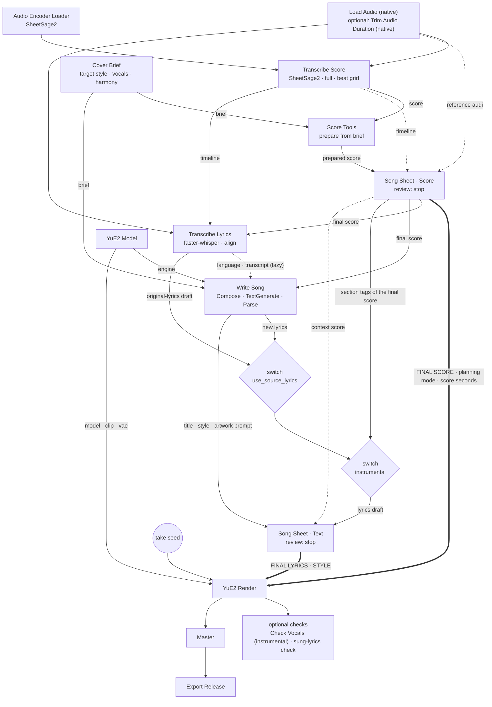

# YuE2 Cover Design (package item I)

| | |
|---|---|
| Status | **Final specification (Phase 4A design gate, 2026-09-25)**; implemented in Phase 4B after the owner's authorization |
| Scope | The **YuE2 Cover** path: source audio, score transcription, original lyrics (automatic, corrected, fully manual), new lyrics, instrumental covers, score generation and editing, the authoritative final lyrics and score, conditioning, validation |
| Related | [yue2-design.md](yue2-design.md) (engine, render), [instrumental-strategy.md](instrumental-strategy.md), [score-editor-design.md](score-editor-design.md), [target-architecture.md](target-architecture.md), study data: [2026-09-25-phase-4a.md](../test-reports/2026-09-25-phase-4a.md) |

Evidence tags as in Phase 1A: [VF] verified in code or documentation, [UP] upstream documentation, [CM] community report, [RE] legacy result, [AS] assumption, **[4A]** measured in the Phase 4A studies (study id in brackets, e.g. [4A E1]).

---

## 0. Decisions of this design gate

| # | Question | Decision | Evidence |
|---|---|---|---|
| 1 | Single source of truth | Two Song Sheets: **Song Sheet · Score** owns the score, **Song Sheet · Text** owns title, style, lyrics and artwork prompt. Everything YuE2 receives comes from these two outputs, unchanged (§3). | design, Phase 3 WYSIWYG host test |
| 2 | Order | Score first, lyrics second: lyrics sections, ASR placement, new-lyrics phrasing and instrumental tags depend on the **final** score (§2). | design |
| 3 | Transcription | New node **Transcribe Score** runs the native SheetSage2 encoder and native `events_to_abc` (full mode), so the ABC is byte-identical to `SheetSage2AudioToABC`, and additionally returns the decoded **beat grid** as a `PLENIO_TIMELINE` (§8). | [4A E1] identical ABC on 6/6 files; constant-tempo reading of the ABC is off by up to 2.1 s |
| 4 | Lyrics ASR (D-04) | **faster-whisper large-v3** (CTranslate2) in a Plenio worker subprocess, **VAD off**, beam 5, word timestamps, deterministic settings, on-disk result cache. Qwen3-ASR stays a possible later engine (not measured: needs a 4.5 GB download and an isolated environment). | [4A E2] WER 0.8–1.2 % on a produced pop vocal, 6.7–8.6 % on YuE2 vocals; VAD removes all sung words |
| 5 | Alignment | Words go to the bar that contains their midpoint on the **beat grid**; a phrase that starts less than one bar before a section's first downbeat (pickup) moves to that section; lines follow the ASR segments (§10.3). | [4A E2b] 99.4–100 % section accuracy where the singer followed the lyric sheet |
| 6 | Vocal separation (D-05) | **Not built** in 4B: ASR on the full mix already reaches ~1 % WER on the test material; separation stays a conditional node (C2) for dense mixes. Delivered audio is never separated. | [4A E2] |
| 7 | Default cover mode | **Instrumental · instrument plays the vocal melody**, harmony **new** (owner confirmation 2026-09-25). | owner |
| 8 | Accompaniment only | Allowed, but with *harmony: new* the Cover Brief warns that almost nothing of the source remains (the prepared score keeps only the instrumental line). | [4A E5] 25 notes left in 42 bars |
| 9 | Instrumental adapter (D-06) | See [instrumental-strategy.md](instrumental-strategy.md) §10: keys load completely; effect measured per condition. | [4A E4/E5], AS-07 |
| 10 | Output validation | **Sung-lyrics check** (ASR of the take compared per section with the final lyrics) is practical and becomes an optional block; *Check Vocals* for instrumental takes; score re-transcription stays a diagnostic. | [4A E2] a take that sang the chorus in place of verse 2 scored 32 % WER, correctly sung takes 0.8–8.6 % |
| 11 | Review defaults | Cover template: **stop for review on both sheets** (three short runs: approve score → approve texts → render). The owner may prefer *continue* on the text sheet; to be confirmed in the 4B usability check (Q-C7). | recommendation |

---

## 1. Upstream workflow (what we implement)

1. Transcribe the recording with SheetSage2 and **review** melody, meter, key and section order; "transcription errors can carry into the cover" [UP].
2. For style changes use `cot="melody"` with a chord-free score; `cot="full"` keeps the original harmony [UP]. SheetSage2 melody-only output keeps both `Vocal` and `Ins` melodies and omits chords [UP].
3. Get the lyrics (find them, or transcribe the singing), check them, organise them into sections that match the recording; align section tags and lyric order with the score [UP].
4. Generate with target style + lyrics + ABC [UP].
5. Treat SheetSage2 transcription of the result as a diagnostic, not ground truth [UP].

Native building blocks: `LoadAudio`, `TrimAudioDuration` (start/duration in seconds), `AudioEncoderLoader`, `SheetSage2AudioToABC(mode)` (list output), `YuE2GenerateMusic` with `abc`, `ComfySwitchNode` (lazy branches) [VF].

---

## 2. Data flow

### 2.1 Graph (the *YuE2 · Cover* template)



Properties:

- **Acyclic, one owner per document.** The two sheets are the only nodes whose outputs reach `YuE2GenerateMusic`.
- **Lazy.** Every sheet input is lazy; the two native switches are lazy. Only the branch that the brief and the document states need is executed: with *manual* lyrics neither ASR nor the LLM lyrics run; with a *manual* score neither SheetSage2 nor Score Tools run; in *new lyrics* mode ASR runs only if the user asked for the source transcript as phrasing reference.
- **Score before text.** Transcribe Lyrics, Write Song and the lyrics draft read the final score, so section edits made in the score sheet flow into the lyrics draft (and, if the user had edited the lyrics, produce a conflict instead of an overwrite, §5).
- **Score generation = transcription.** The cover path never re-plans the melody with YuE2's planner; the score is the source's transcription, prepared deterministically and edited by the user. A new melody is the Song path.

### 2.2 Document states (both sheets)

```mermaid
stateDiagram-v2
    [*] --> auto
    auto --> edited: user edits the draft (base = draft hash)
    auto --> manual: user switches to manual / pastes
    edited --> edited: draft unchanged → edit used
    edited --> conflict: draft changed upstream
    conflict --> manual: keep my version
    conflict --> auto: discard my edit
    conflict --> edited: rebase onto the new draft
    edited --> auto: revert
    manual --> auto: revert to automatic
    note right of manual: never replaced by an automatic stage;\nits upstream is not executed
```



A conflict stops the run before generation (the sheet raises; nothing downstream executes). With *stop for review* the outputs are released only when the resolved documents' fingerprint equals the approved one (Phase 3 mechanism, [target-architecture.md](target-architecture.md) §6).

### 2.3 Runs with the default review settings

| Run | Executes | Stops at |
|---|---|---|
| 1 | Load → Transcribe Score (~20–70 s) → Score Tools → Song Sheet · Score | score review |
| 2 (after approving the score) | Transcribe Lyrics (~4–12 s on the GPU) and/or Write Song (~10 s) → Song Sheet · Text | text review |
| 3 (after approving the texts) | YuE2 Render (0.35–0.55 × the song length on the owner's GPU; ~30 s for an 83-s cover) → optional checks → Export | — |

Cached nodes do not re-run; a new take only re-runs the render and what follows.

---

## 3. What reaches YuE2 (conditioning)

| `YuE2GenerateMusic` input | Source (only) |
|---|---|
| `style` | Song Sheet · Text → style |
| `lyrics` | Song Sheet · Text → lyrics |
| `abc` | Song Sheet · Score → score |
| `mode` | Song Sheet · Score → planning mode (chords present → `full`, else `melody`) |
| `max_duration` | Song Sheet · Score → score seconds (`render_ceiling`) |
| `seed` | take seed |

Nothing between the sheets and the native node changes these values. The release record stores the texts with hashes, their states, the approval fingerprint, the source audio hash, the timeline hash and the ASR/transcription engine ids.

---

## 4. User modes

The **Cover Brief** owns exactly two choices; which lyrics text is used is a **state of the lyrics document**, never a second mode.

### 4.1 `vocals`

| `vocals` | Lyrics draft (auto) | What runs for the draft | Score preparation |
|---|---|---|---|
| **Original lyrics** | ASR words placed into the final score's sections | Transcribe Lyrics | Vocal voice kept |
| **New lyrics** | LLM lyrics written against the final score's phrasing map | Write Song (optional: ASR transcript as phrasing reference) | Vocal voice kept |
| **Instrumental · instrument plays the vocal melody** (default) | section tags of the final score | nothing (tags are derived) | Vocal notes moved into `Ins` |
| **Instrumental · accompaniment only** | section tags of the final score | nothing | Vocal notes replaced by rests |

Options per mode (DynamicCombo children): original → language (`auto` or explicit); new → language, theme, *use the source transcript as phrasing reference* (off); instrumental → melody option, optional lead instrument.

### 4.2 `harmony`

| `harmony` | Score preparation | Planning mode (derived from the final score) |
|---|---|---|
| **New accompaniment** (default; upstream recommendation for style covers) | chord symbols removed | `melody` |
| **Keep original chords** | chords kept | `full` |

### 4.3 The five lyrics situations

| Situation | Document state | ASR executed? | LLM lyrics executed? |
|---|---|---|---|
| automatic original lyrics | `auto` (mode original) | yes (cached) | no |
| manually corrected original lyrics | `edited`, `base_sha256` = hash of the ASR draft | yes (cached; re-runs give the same draft, §5.3) | no |
| fully manual lyrics | `manual` | **no** (lazy input not requested) | no |
| new lyrics | `auto`/`edited` (mode new) or `manual` | only as optional phrasing reference | yes unless manual |
| instrumental | `auto` = section tags; `edited`/`manual` allowed but tags only | no | no |

### 4.4 Combinations that warn or fail

| Combination | Result |
|---|---|
| accompaniment only + harmony new | warning in the Cover Brief and the score sheet: "only the instrumental line and the form remain; the cover will barely resemble the source" — the prepared score's note count is shown |
| original or new lyrics, but the final score has no `Vocal` notes | score sheet warning: "no vocal melody — is the source instrumental?"; suggests instrumental mode or manual lyrics |
| instrumental, lyrics contain words (edited/manual) | validation error in the text sheet (G1) |
| manual lyrics while the brief mode changed | text sheet notice "manual lyrics in use — brief says <mode>"; instrumental + words → error |
| score bar structure differs from the transcription (edited/manual score) | lyrics alignment falls back to label order or source order (§10.3), with a warning |

---

## 5. Lyrics precedence

### 5.1 Rules (implemented once in `core.sheet.resolve`; unchanged from Phase 3)

1. `manual` beats everything and is never replaced by an automatic stage; its upstream is not executed.
2. `edited` is used only while its upstream draft is unchanged (hash equal to `base_sha256`).
3. `edited` with a changed draft → **conflict: the run stops** before generation. The editor offers *keep my version (becomes manual)*, *discard my edit (back to auto)*, *compare and rebase*.
4. `auto` uses the upstream draft.
5. Validation errors stop the run; warnings are shown and recorded.
6. With *stop for review*, outputs are released only for the approved fingerprint.

### 5.2 Truth table

| Brief mode | Doc state | Upstream | Final lyrics | Notes |
|---|---|---|---|---|
| original | auto | ASR ok | ASR words in the final score's sections | |
| original | auto | no reliable words (fewer than 5 words with p ≥ 0.5, or none) | **stop** | no fallback to LLM or tags; the message suggests an explicit language, trimming, or manual lyrics |
| original | edited | draft unchanged | edited text | |
| original | edited | draft changed (ASR language/engine, source audio, trim, score sections or bars) | **stop (conflict)** | e.g. the user moved a section boundary in the score sheet after editing the lyrics |
| original | manual | — | manual text | ASR not executed |
| new | auto | LLM ok | LLM lyrics | Parse checks sections against the final score |
| new | edited | unchanged / changed | edited / **stop** | e.g. draft seed changed |
| new | manual | — | manual text | LLM still writes style/title if those are `auto` |
| instrumental | auto | — | section tags of the final score | |
| instrumental | edited / manual | — | edited/manual text | **tags only**; words → validation error |
| any | manual, brief mode changed | — | manual text | notice; instrumental + words → error |

### 5.3 Why an edit stays valid across runs

The conflict rule compares the **draft hash**, so the automatic chain must be reproducible:

- SheetSage2 transcription is deterministic (identical ABC on repeated runs and between the native node and Transcribe Score [4A E1]).
- faster-whisper's default temperature fallback samples at temperature > 0 when a segment looks unreliable; on the instrumental take two runs produced 69 and 36 hallucinated words [4A E2]. Plenio therefore (a) decodes with `temperature=0` only and (b) stores every ASR result in an on-disk cache keyed by source audio hash, engine, model revision and settings (`user/plenio/cache/asr/`). A ComfyUI restart re-uses the stored result instead of decoding again.
- Alignment and draft formatting are pure functions of (ASR result, timeline, final score).

The same holds for the score draft (transcription + deterministic preparation).

### 5.4 Inspection

The text sheet shows, for original lyrics: the ASR draft next to the used text (diff), the plain transcript with timestamps, the detected language with probability, low-confidence words (p < 0.5) highlighted, per-section word counts vs. vocal notes, and which version is in use (*automatic*, *edited — based on draft …*, *manual*).

---

## 6. Score precedence

| Doc state | Upstream | Final score |
|---|---|---|
| auto | prepared transcription | prepared score |
| edited | unchanged | edited score |
| edited | changed (new source, trim, harmony or vocals choice, SheetSage2 model/version) | **stop (conflict)** |
| manual | — | manual ABC (pasted/imported); Transcribe Score and Score Tools not executed |

A manual or edited score must pass native-dialect validation (vendored upstream parser). If the brief's harmony or vocals choice contradicts the final score (e.g. harmony *new* but the score has chords; instrumental but `Vocal` has notes), the **score wins** for the planning mode, and: chords vs. harmony → warning; sounding `Vocal` notes in instrumental mode → **validation error** (G1).

---

## 7. Source audio

- Loaded with native `LoadAudio`; decoding errors surface from the native node (the guide lists re-export as WAV/FLAC).
- **Excerpts** use native `TrimAudioDuration` (start and duration in seconds) before transcription [VF]. The guide recommends starting on a downbeat: a full song's transcription starts with a padded pickup bar (the first decoded beats are notated as a full bar with a leading rest) [4A E1], an excerpt cut on a downbeat did not.
- **Length limit.** The native SheetSage2 `transcribe` already works in sliding windows (300 s, 200 s overlap, token prefixes carried over) and its encoder **pads every window to 300 s** [VF `comfy/audio_encoders/sheetsage2.py`]. Memory is therefore independent of the length up to 300 s: the peak was ~16.6 GiB for 108–120-s pieces on the owner's 16 GB card (a little more than the card has; Windows' shared-memory fallback absorbed it), and a 357-s take — two native windows — failed with *CUDA out of memory* after 29 GiB had been allocated [4A E3]. Transcribe Score therefore stops sources longer than one native window (300 s) on cards below a measured memory threshold, **before** starting, with a clear message (trim with `TrimAudioDuration`, e.g. one cover per part of the song) — and catches CUDA out-of-memory with the same message. Plenio does not re-implement SheetSage2's windowing.
- The same `AUDIO` feeds transcription, ASR and the editor's A/B playback (`reference_audio` display input of the score sheet).

---

## 8. Transcription — `Plenio · Transcribe Score`

### 8.1 Why a Plenio node instead of the native node alone

Aligning sung words to bars needs the bars' **times in the source**. The native node returns only ABC strings. Its ABC is written at one tempo (`Q:` = total quarters / total seconds), while its notes are quantised to the real beat grid; the first decoded beats become a padded pickup bar. Reading the ABC at constant tempo therefore misplaces bars by up to **2.1 s** on YuE2 takes (≈ ¾ bar at 83 BPM) and by up to 1.0 s on a 4-minute pop song [4A E1]. With the beat grid, placement is exact within the transcription's own grid.

### 8.2 Behaviour

- Blueprint *Plenio · Transcribe Score* = native `AudioEncoderLoader` (SheetSage2) + node `PlenioTranscribeScore`; the blueprint also outputs the `AUDIO_ENCODER` so *Check Vocals* reuses the loaded model.
- The node mirrors `SheetSage2AudioEncoder.generate_abc` for one item (mono downmix, resample to the model rate, `model.transcribe`) and calls the native `events_to_abc(..., melody_only=False)` → the ABC equals the native node's `full` output byte for byte [4A E1, 6/6 files]. From the same decoded events it builds the timeline with the native `infer_measures` (beat list extended to the end exactly as `events_to_abc` does).
- Always **full** mode; the harmony choice is applied afterwards (full + strip chords ≡ melody output [VF]).
- The timeline is accepted only if its bar count equals the ABC's bar count (6/6 in the study); otherwise it is dropped with a warning.
- **Fallback:** if the SheetSage2 internals change in a ComfyUI update (missing `model.transcribe`, `events_to_abc` or `infer_measures`), the node calls the public `generate_abc`, emits an empty timeline and warns "timeline unavailable — lyrics alignment will use section order". A contract test pins the internals (§18).
- Batch input: first item only, with a warning for more.
- Report: bars, tempo (score and median local tempo), meter/key changes, sections with start times, notes per voice, pickup padding, empty `Vocal` warning.

### 8.3 Measured quality [4A E1]

| Source | Bars (plan → transcription) | Key | Tempo | Sections | `Vocal` notes (plan → transcription) |
|---|---|---|---|---|---|
| YuE2 take, 130 s | 46 → 46 | B♭ = B♭ | 82 → 83 | same labels and order; last chorus/outro boundary moved 5 bars | 101 → 100 |
| YuE2 take, 156 s | 55 → 55 | B♭ = B♭ | 82 → 83 | same order; boundary moved 2 bars | 100 → 101 |
| YuE2 take, 194 s | 68 → 68 | B♭ = B♭ | 82 → 83 | same order; boundary moved 8 bars | 196 → 198 |
| YuE2 instrumental, 74 s | 27 → 27 | E♭ = E♭ | 82 → 83 | identical | 0 → 0 |
| MiniMax song, 241 s (126 BPM requested) | — → 123 | A | 122 (local median 121.8) | intro, verse, pre-chorus, chorus ×3, verse, bridge — matches the lyric sheet except post-chorus/outro | 441 |

Transcription takes 20–70 s per song on the RTX 5060 Ti. Section **labels and order** are reliable on this material; section **boundaries** can be off by several bars — the score sheet is where the user fixes them (§14).

---

## 9. Score preparation — `Score Tools · prepare from brief`

| Operation | Rule | Invariants (upstream parser + compare) |
|---|---|---|
| strip chords (harmony *new*) | remove quoted chord symbols | notes, onsets, durations, meters, tempo unchanged |
| keep vocals (original/new lyrics) | no change | — |
| instrument plays the vocal melody | per bar: if `Vocal` sounds, `Ins` gets exactly those notes and `Vocal` gets equal-length rests (policy *replace*); bars where `Vocal` rests keep their `Ins` notes; ties fixed at the bar edges | bar grid, meters, keys, tempo unchanged; no sounding `Vocal` notes; dropped `Ins` notes counted and reported |
| accompaniment only | `Vocal` notes → equal-length rests; chords stay in `Vocal` if harmony *keep* | as above; `Ins` unchanged |
| transpose / tempo (explicit) | deterministic, validated | per operation |

Measured on the MiniMax excerpt: lead conversion moved the melody in 37 of 42 bars without dropping an `Ins` note (163 + 25 = 188 notes); accompaniment only left 25 notes [4A E5]. The conflict policy (*replace* vs. *keep Ins where both play*) is kept at *replace*; listening comparison is part of the owner's listening pack (Q-C3).

---

## 10. Original lyrics — `Plenio · Transcribe Lyrics`

### 10.1 Engine (D-04)

| Engine | Status | Evidence |
|---|---|---|
| **faster-whisper large-v3** (CTranslate2, MIT; weights MIT) | **default** | WER 0.8 % (excerpt) and 1.2 % (full song) on the MiniMax pop vocal; 8.6 % and 6.7 % on YuE2 vocals where the singer followed the lyrics (10.8 % before removing a 7-word stage direction that was, correctly, not sung); language auto-detected (en, p 0.81–0.96); 4–12 s per song on the GPU, 53 s for 83 s of audio on the CPU (int8) with the same WER [4A E2] |
| faster-whisper with Silero VAD | **rejected** | the VAD classifies singing over music as non-speech: 0 words [4A E2] |
| Gemma 4 E4B via native `TextGenerate` (audio input) | **rejected as ASR**, used as the `listen` detector | WER 10.6 % (M2) and 46.9 % (Y1) vs. 0.8 % / 8.6 % for faster-whisper; no word timestamps (30-s windows), so no bar placement [4A E2c] |
| Qwen3-ASR (+ForcedAligner) | not measured; optional later engine | 4.5 GB download and `transformers==4.57.6` (host 5.5.4) need an isolated environment (AS-11) |

Worker: faster-whisper runs in a **Plenio worker subprocess** using the host Python (crash isolation, VRAM released on exit; `core.workers` protocol from Phase 2). Before starting, Plenio asks ComfyUI to free VRAM for ~4 GB. On Windows, CTranslate2 4.x needs the CUDA 12 cuBLAS (`nvidia-cublas-cu12` wheel) and cuDNN 9 (next to torch); the worker adds both folders to the DLL search path, and falls back to CPU int8 with a warning (time estimate in the report) if CUDA cannot be used. If `faster_whisper` is not importable, the node raises `PlenioDependencyError` with the install command; Plenio never installs packages during a run.

Model: the CTranslate2 conversion of Whisper large-v3 (≈ 3.1 GB), resolved from the Plenio asset directory or an existing folder configured in `config.toml` (the owner already has `models/audio_encoders/whisper-large-v3`); downloads follow the Phase 2 asset policy (pinned revision, explicit consent, offline mode respected).

Settings: `vad_filter=False`, `beam_size=5`, `word_timestamps=True`, `condition_on_previous_text=False`, `temperature=0` (§5.3), language `auto` or explicit.

### 10.2 Hallucination and "no singing" handling

On an instrumental take Whisper produced invented text ("Thank you for watching!", 10–69 words, mean word probability 0.40–0.52) while sung takes had mean word probability 0.89–0.95 [4A E2]. On sung takes the invented words appear after the singing has ended ("Thank you.", "you", "you next time.") — sometimes with high probability (0.997), so probability alone does not identify them. The transcription does: in all three cases SheetSage2 found **no `Vocal` note within 6 s** of those words, whereas the genuine last words of the MiniMax song had 16 [4A E2].

Rules in Transcribe Lyrics:

1. Words with p < 0.5 are reported as low confidence (highlighted in the sheet), never removed for that reason alone.
2. A phrase of at most 4 words that lies in a stretch without `Vocal` notes (none within 6 s, measured on the timeline) is treated as an ASR invention: it is left out of the draft and listed in the report, so the user can re-add it.
3. Original mode stops with "no reliable singing found" if, after rule 2, fewer than 5 words with p ≥ 0.5 remain; the message suggests an explicit language, trimming, or manual lyrics. The threshold is re-checked with the detector data (instrumental-strategy §6.2).

### 10.3 Alignment into sections (pure, `core.lyrics.align`)

Input: ASR words (start, end, probability, segment), the timeline (bar start times), the final score (bars, sections).

1. **Bar placement:** each word goes to the bar whose grid interval contains the word's midpoint.
2. **Section placement:** bars map to the final score's sections by bar index — section edits in the score sheet are respected.
3. **Pickup rule:** for each section start, if a phrase begins within the last bar before the section's first downbeat and continues without a phrase break into the section, the phrase's words move to that section. A phrase begins at the first word, after a pause ≥ 0.3 s, or at an ASR segment start. Continuous singing across a boundary is not moved.
4. **Lines:** one line per ASR segment; additionally a new line after a pause > 0.9 s. Tokens that start with `-` or `'` are joined to the previous word.
5. **Word order is preserved exactly** (ordered-word check including repetitions); no word is invented or dropped except by rule 2 of §10.2, which is reported.

Fallbacks (never invented timestamps):

| Situation | Placement |
|---|---|
| timeline present, final score has the same bar count and meters as the transcription | steps 1–4 |
| bar structure differs, but the final score's section label sequence equals the transcription's | words go to sections via the transcription's sections (label order), warning |
| otherwise, or no timeline | one untagged block in source order + warning "lyrics need sectioning"; the user edits the sections in the text sheet |

Measured section accuracy on words matched to the reference lyric sheet [4A E2b]:

| Source | midpoint on beat grid | constant tempo (ABC `Q:`) | beat grid + pickup rule |
|---|---|---|---|
| MiniMax excerpt (83 s) | 95.9 % | 95.9 % | **100 %** |
| MiniMax full song (241 s) | 94.9 % | 90.7 % | **99.4 %** |
| YuE2 take 194 s | 97.9 % | 85.5 % | **100 %** |
| YuE2 takes 130 s / 156 s | 80.0 % / 75.9 % | 61.3 % / 65.5 % | 89.3 % / 86.2 % |

The remaining errors in the last row are not alignment errors: the words are placed where they are sung, but SheetSage2's section boundary (chorus/outro) differs from the lyric sheet, and in the 156-s take YuE2 sang the chorus where the second verse was planned. The automatic draft for the excerpt was usable as is (one joined token, "half -dead").

### 10.4 Outputs

`lyrics` (sectioned draft, tags from the final score), `transcript` (plain text with timestamps in the report), `language` (detected), `report` (engine, model, device, timing, words per section, low-confidence words, alignment method, fallbacks, cache hit).

---

## 11. New lyrics

- **Retained** from the source: melody (the `Vocal` notes), rhythm, bar grid, sections (labels, order, length), key, tempo, meter — unless Score Tools changed them explicitly.
- **Regenerated:** words, style, title, artwork prompt (and the arrangement, which YuE2 renders from the style).
- Compose receives the brief (language, theme) and the final score's **phrasing map**, computed in `core.score`: per section the label, bars, vocal-note onsets and phrases (split at `Vocal` rests ≥ 1 beat) with notes per phrase. The LLM writes one line per phrase with roughly one syllable per note (melismas allowed; onsets are not syllables).
- Optional phrasing reference: the source transcript (only if enabled; this runs ASR).
- Parse requires the lyrics sections to match the final score's sections in number and order; a mismatch is a draft error (no automatic re-tagging).
- The text sheet shows a per-section fit report (estimated syllables vs. vocal notes).
- Evidence: see §17.3 and [4A E5] (a hand-written new text with the same line structure rendered over the transcribed melody).

---

## 12. Instrumental covers

Summary; details, guarantee levels and measurements in [instrumental-strategy.md](instrumental-strategy.md) §4 and §13:

- **Deterministic (G1):** the final score has no sounding `Vocal` notes; lyrics are section tags only; the style has no vocal/language terms and names the lead instrument positively (*lead* choice). All three are validated in the sheets before rendering.
- **Conditioning (G2):** melody or full mode per harmony choice; concise instrumental style.
- **Adapter (G3):** instrumental AR LoRA, optional, bypassed by default (D-06).
- **Measurement (G5):** *Check Vocals* per take; optional *Takes* block.

---

## 13. Style and title for covers

- Target style from the Cover Brief → concise YuE2 descriptor style ([yue2-design.md](yue2-design.md) §3.1).
- Original lyrics: the style names the lyrics language — the brief's explicit language or, with *auto*, the language detected by ASR (Compose requests `language` lazily; with manual lyrics and *auto*, ASR runs for the language only — the brief's explicit language avoids that).
- New lyrics: the brief's language. Instrumental: no language, no vocal character; the lead instrument if chosen.
- Tempo: the style states the final score's tempo (read from the score, not invented), so style and score never disagree.
- Title: optional fixed title in the Cover Brief (e.g. "Original Title (Jazz Cover)"), otherwise the LLM proposes one; the text sheet owns the final title.

---

## 14. Score editing in the cover flow

The score sheet sits **after** transcription and preparation and **before** lyrics and render. It is where transcription errors are fixed:

| Edit | Effect downstream |
|---|---|
| relabel sections, move a section boundary (most frequent need: [4A E1] boundaries off by 2–8 bars) | lyrics draft re-derived from the new sections; an edited lyrics document conflicts |
| correct notes, transpose, change tempo | render uses the edited score; lyrics alignment unaffected (same bars) |
| insert or delete bars, paste a different score | the timeline no longer matches → alignment fallback (§10.3) with a warning |
| switch vocals/harmony in the brief | prepared score changes → an edited score conflicts |

4B dialog (text-based, before the Phase 5 notation editor): ABC text, section table (label, bars, start time from the timeline, vocal notes), "play this section of the source" (reference audio at the timeline time), validation. The Phase 5 editor adds notation, note editing and section-boundary drag.

---

## 15. Backend contracts

### 15.1 Nodes

| Node | Inputs | Outputs | Notes |
|---|---|---|---|
| **Cover Brief** `PlenioCoverBrief` | template, description, genre, mood (target style); `vocals` DC; `harmony`; optional fixed title | `brief` (`kind=cover`, vocals, melody option, lead instrument, language, theme, phrasing reference, harmony, title), `brief_text`, `use_source_lyrics`, `instrumental` | warns for accompaniment + harmony new |
| **Transcribe Score** `PlenioTranscribeScore` (new, §8) | `audio_encoder`, `audio` | `score` (native full ABC), `timeline` (`PLENIO_TIMELINE`), `report` | inside the *Transcribe Score* blueprint |
| **Score Tools** | `score`, `brief` | `score`, `section_tags`, `report` | cover preparation from `vocals` + `harmony` |
| **Song Sheet** (score instance) | lazy `score`; display `reference_audio`, `timeline` | `score`, `planning_mode`, `score_seconds`, **`section_tags`** (new: tags of the final score), `report` | review default *stop* in the cover template |
| **Transcribe Lyrics** `PlenioTranscribeLyrics` | `audio`; optional `score` (final), `timeline`, `expected_lyrics` (turns on the sung-lyrics check); widgets `language` (N), `device` (A: auto/cuda/cpu) | `lyrics`, `transcript`, `language`, `report` | worker + cache; `engine` widget appears when a second engine exists |
| **Write Song** blueprint | brief, engine, final `score`; lazy `language`, `reference_lyrics` | title, style, lyrics, artwork prompt, report | Compose builds the phrasing map; original/instrumental modes do not ask the LLM for lyrics |
| native `ComfySwitchNode` ×2 | `instrumental` ? tags : (`use_source_lyrics` ? ASR : LLM) | lyrics draft | lazy branches |
| **Song Sheet** (text instance) | lazy `title`, `style`, `lyrics`, `artwork_prompt`; context `score` | final texts, report | validation incl. G1 and section match |
| **Check Vocals** | takes (list), brief, `audio_encoder` | best take, `passed`, report | [instrumental-strategy.md](instrumental-strategy.md) §6 |

### 15.2 Types

`PLENIO_TIMELINE` — `plenio.timeline/1`:

```json
{
  "schema": "plenio.timeline/1",
  "source_sha256": "…", "score_sha256": "… (the transcription the grid belongs to)",
  "engine": "sheetsage2", "duration_s": 83.02, "first_beat_s": 0.0,
  "pickup_padded": false, "tempo_bpm": 121, "median_bpm": 121.4,
  "bars": [[0.0, 1.98, "4/4"], [1.98, 3.96, "4/4"]],
  "sections": [["verse", 1, 16], ["pre-chorus", 17, 8]]
}
```

The ASR result stored in the cache and passed inside the worker protocol: `plenio.asr/1` — engine, model, revision, settings, language + probability, segments (start, end, text), words (start, end, word, probability, segment).

### 15.3 Routes

Existing routes cover the dialog (`/plenio/score/analyze`, `/plenio/score/transform`, `/plenio/lyrics/analyze`, `/plenio/sheet/resolve`). `lyrics/analyze` gains the per-section fit report against a score and the ASR-draft diff. No new route is needed for the cover path.

### 15.4 Workers and caches

`plenio.workers.asr` (entry point for the worker protocol), `user/plenio/cache/asr/<key>.json` (key = sha256 of source audio hash + engine + model revision + settings). The cache is a performance and reproducibility aid; deleting it only costs a re-decode.

---

## 16. Frontend implications

| Place | Change |
|---|---|
| Cover Brief node | DynamicCombo `vocals` with mode-specific children; `harmony`; inline warning for accompaniment + harmony new |
| Song Sheet dialog · Score tab | section table with times from the timeline; play-section of the reference audio; state badge; warnings (no vocal melody, bar structure changed) |
| Song Sheet dialog · Lyrics tab | ASR draft vs. used text (diff), transcript with timestamps, detected language, low-confidence words highlighted, per-section fit (syllables vs. vocal notes), badge "automatic / edited / manual"; conflict dialog (keep / discard / rebase) — the Phase 3 intents |
| Node summaries | Transcribe Score: bars, key, tempo, sections; Transcribe Lyrics: words, language, alignment method, cache hit; sung-lyrics check: WER per section |
| Template | groups *Source*, *Score*, *Lyrics & Style*, *Render*, *Checks (optional, bypassed)*, *Master & Export*; notes explain the three runs |

The frontend never computes alignment, fingerprints or validation; it calls the routes.

---

## 17. Validation strategy

### 17.1 Before generation (deterministic, in the sheets)

ABC valid in the native dialect; context budget (the measured transcriptions use ~20 ABC tokens per bar, a 4-minute song 2 500 tokens, leaving > 850 s of music budget [4A]); planning mode derived; lyrics sections equal the score sections (original/new); instrumental: no `Vocal` notes, tags only, no vocal terms in the style; style language equals the lyrics language; per-section fit warnings.

### 17.2 After generation (optional blocks, measured, never a guarantee)

| Check | How | Use |
|---|---|---|
| **Sung-lyrics check** (original/new lyrics) | Transcribe Lyrics on the take with `expected_lyrics` = final lyrics → WER overall and per section, missing/extra/swapped sections | flags skipped or swapped sections; [4A E2]: correctly sung takes 0.8–8.6 % WER; a take that sang the chorus in place of verse 2 scored 32 % |
| **Check Vocals** (instrumental) | detector per [instrumental-strategy.md](instrumental-strategy.md) §6 | pass/fail per take, best take |
| **Identity diagnostic** | re-transcription of the take vs. the final score: bars, key, tempo, section order, melody overlap | diagnostic only [UP] |

### 17.3 Measured cover feasibility [4A E5]

See the test report §E5 for per-take numbers: render time, duration vs. score, re-transcription identity (bars, key, sections, melody overlap), sung-lyrics WER (original and new lyrics), vocal presence in instrumental modes.

---

## 18. Test matrix (Phase 4B)

| Axis | Values |
|---|---|
| vocals mode | original, new, instrumental-lead, instrumental-accompaniment |
| harmony | keep, new |
| lyrics doc state | auto, edited (draft unchanged), edited (draft changed), manual |
| score doc state | auto, edited, edited-stale, manual (valid), manual (invalid) |
| review | continue, stop (unapproved), stop (approved), approved then upstream changed |
| timeline | present, absent (fallback), bar structure changed |
| ASR | cache hit, cache miss, language auto/explicit, no reliable words, engine missing, CUDA unavailable → CPU |
| failures | transcription error (fake), malformed ABC, section mismatch (new lyrics), worker crash, worker cancelled |

Each combination asserts which upstream nodes executed (laziness), the final documents, blocked/unblocked outputs and report contents. Unit tests for `core.lyrics.align` use synthetic grids (pickups, continuous singing across boundaries, repeated words, empty sections) and the recorded study data. Contract tests: `PlenioTranscribeScore` ABC equals `SheetSage2AudioToABC(full)` on a fixture and the timeline bar count equals the ABC bar count (needs the SheetSage2 file, `comfy` marker); the worker runs faster-whisper on a short sung fixture. Real-model runs on the owner's GPU: one song per mode.

---

## 19. Failure modes

| Failure | Behaviour |
|---|---|
| source cannot be decoded | native `LoadAudio` error; guide explains re-export |
| SheetSage2 fails (fewer than two beats, no key) | native error surfaced by Transcribe Score with causes |
| source longer than one native SheetSage2 window (300 s) on a card below the measured memory threshold | stopped before transcription with the trim hint (§7); CUDA out-of-memory during transcription is caught and reported the same way |
| SheetSage2 internals changed | timeline unavailable warning; ABC via the public method; alignment falls back |
| no vocal melody in the score, mode original/new | score sheet warning; suggests instrumental or manual lyrics |
| section boundaries wrong | visible in the score sheet (times + play section); user fixes; lyrics follow |
| faster-whisper missing | `PlenioDependencyError` with the install command |
| CUDA libraries for CTranslate2 missing | CPU fallback with a warning and time estimate |
| ASR returns no reliable words | stop (original mode), no silent fallback |
| ASR invents words where nobody sings (typically after the song) | phrases of ≤ 4 words without `Vocal` notes within 6 s are left out of the draft and reported (§10.2) |
| alignment cannot use the grid | label-order or source-order fallback with a warning |
| LLM lyrics sections mismatch the score | draft error; regenerate or edit |
| stale edit | conflict stop with three choices |
| words in instrumental lyrics / `Vocal` notes in instrumental score | validation error |
| YuE2 skips or swaps sections | sung-lyrics check (optional) reports it; new take |
| context budget exhausted | validation error with token breakdown |
| non-commercial licence (YuE2, adapter) | notice in node help, docs and record |

---

## 20. Unresolved assumptions and required experiments

| ID | Assumption / question | Why still open | Experiment | Phase |
|---|---|---|---|---|
| Q-C1b | faster-whisper quality on **German** lyrics, dense rock/electronic mixes and live recordings | no such test material with known lyrics available locally | WER on 5–10 owner-supplied songs (EN/DE) | 4B (owner material) |
| Q-C1c | Qwen3-ASR better than faster-whisper on the owner's material | needs a 4.5 GB download + isolated environment | same WER set; only with the owner's consent to download | later / on request |
| Q-C2 | isolated worker environment on venv and portable installs (AS-11) | not needed for the default engine; needs package downloads | spike when the first conflicting engine is added | when needed |
| Q-C3 | lead conflict policy and accompaniment-only quality | listening judgement | owner listening pack (Phase 4A) + 4B check | 4B |
| Q-C5 | detector thresholds | small labelled set in 4A | extend with every 4B take (auto-labelled by mode + owner verdicts) | 4B |
| Q-C7 | review defaults | usability judgement | 4B usability check with the owner | 4B |
| Q-C8 | alignment when the user changes the bar structure | fallback designed, not measured on real edits | synthetic tests + one real edited cover | 4B |
| AS-17 | SheetSage2 internals used by Transcribe Score stay stable | ComfyUI may change them | contract test + fallback | every update |
| AS-20 | SheetSage2 memory per window and the threshold for sources > 300 s | measured only on the owner's 16 GB Windows card (~16.6 GiB peak per window, second window out of memory); whether 16 GB Linux cards (no shared-memory fallback) transcribe at all is unverified | System Check reports the measured peak once per GPU; test on a Linux host | 4B |
| AS-18 | YuE2 follows supplied lyrics section by section | [4A E2]: one of three YuE2 song takes swapped a section | sung-lyrics check statistics over 4B takes | 4B |
