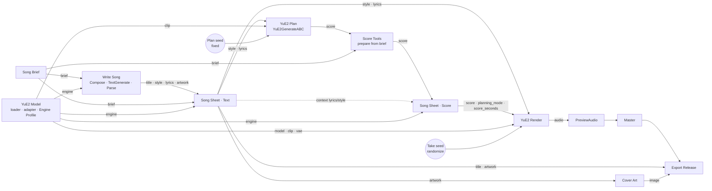

# YuE2 Design (package item H)

| | |
|---|---|
| Status | Phase 1B design baseline — waiting for implementation authorization |
| Date | 2026-09-25 |
| Scope | YuE2 as a first-class engine and the **YuE2 Song** path (text → score → music). The cover path builds on this: [yue2-cover-design.md](yue2-cover-design.md). Instrumental specifics: [instrumental-strategy.md](instrumental-strategy.md). |
| Related | [target-architecture.md](target-architecture.md) §7–§10 |

Evidence tags as in Phase 1A (**[VF]** verified, **[UP]** upstream, **[CM]** community, **[EA]** assessment, **[AS]** assumption).

---

## 1. Upstream and native facts this design relies on

| Fact | Source |
|---|---|
| YuE2-3B takes `style`, `lyrics`, `cot` (`full`/`melody`/`off`), `seed`, `abc`, `cfg_scale`; no reference-audio, phoneme, BPM or negative-prompt input. | [UP] YuE `docs/generation.md`, skill references |
| "Put genre, instruments, vocal character, language, and tempo in `style`." Official examples are short comma-separated descriptor lists (~15–35 words). | [UP] |
| `full` plans melody and chords (default for new songs), `melody` plans melody only, `off` generates without a plan; a supplied ABC bypasses the planner. | [UP] |
| Native nodes: `YuE2GenerateABC` (defaults: 8192 ABC tokens, T 0.7, top-p 0.9, top-k 30, repetition 1.005, window 100), `YuE2GenerateMusic` (max_duration 360 s, max 900; T 1.0, top-p 0.95, top-k 100, repetition 1.2; optional advanced `cfg_scale`, default 1.0 with ABC and 1.01 without), `EmptyYuE2LatentAudio`. An empty `abc` forces `off`. | [VF] `comfy_extras/nodes_yue2.py` |
| Native tokenizer prompt: `<instruction>\n[Tags]\n<style>\n[Lyrics]\n<lyrics>\n`; context 24 576 tokens shared by prefix, ABC and music at **25 frames per second**; the music budget is reduced automatically when the prompt is long and the node raises if nothing is left. | [VF] `comfy/text_encoders/yue2.py:1-60, 242-262` |
| Official templates/blueprints: `CheckpointLoaderSimple(yue2_3b_int8_convrot)`, `KSampler` 32 steps, cfg 1, `dpm_2`, `sgm_uniform`, `ConditioningZeroOut` negative, `VAEDecodeAudio`; ABC planning toggled with `ComfySwitchNode` + `PrimitiveBoolean` and an empty string; `PreviewAny` shows the ABC. | [VF] blueprints, Comfy-Org templates |
| Reference runtime: 24 GB GPU recommended; measured peaks 11.0–14.1 GiB (reference implementation). | [UP] model card |
| The YuE2 checkpoint carries `yue2_tokenizer_json`, so exact token counts are possible from the loaded CLIP. | [VF] `comfy/sd.py:1775` |
| Weights CC BY-NC 4.0. | [VF] |

---

## 2. YuE2 Song path



Why two Song Sheet instances: the plan needs the final text as input, and the score review must see the plan. One node owning both would need the plan's output as its own input — a cycle. The text sheet owns title, style, lyrics and artwork prompt; the score sheet owns the score and only *displays* lyrics and style as context. Each document has exactly one owner.

Default behaviour: both sheets on *continue* (one click from brief to audio). Users who want to inspect set *stop for review* on either sheet.

---

## 3. Documents and engine rules (`core.engines.yue2`)

### 3.1 Style

| Rule | Level |
|---|---|
| Comma-separated descriptors: genre/sub-genre, key instruments, vocal character + language (sung songs), tempo as `NN BPM`, mood/production adjectives | format |
| Target ≤ 40 words / ≤ 300 characters; warning above 60 words; error above 120 words | validation (thresholds [AS-Y1], tuned in Phase 3) |
| No section structure, no timing, no "target duration", no instructions to the model, no ABC | validation error |
| No negations ("no vocals", "without drums"); instrumental is stated positively (`instrumental`, lead instrument) | validation warning (instrumental: see [instrumental-strategy.md](instrumental-strategy.md)) |
| Key in style is allowed but ineffective in community tests; key is set in the score | documentation [CM] |

Rationale: upstream format; legacy evidence that verbose Style prose was sung (Phase 1A §10); shared context budget.

### 3.2 Lyrics

- Section tags on their own line (`[Intro]`, `[Verse]`, `[Pre-Chorus]`, `[Chorus]`, `[Bridge]`, `[Outro]`, …), sung words beneath, blank line between sections.
- Only words to be sung; no production directions, no bracketed stage notes, no repeat shorthands ("(x2)") — repeats are written out.
- Instrumental: tags only (forms in [instrumental-strategy.md](instrumental-strategy.md) §3).

### 3.3 Score

Native two-voice dialect, validated by the vendored upstream parser (`abc_tools.py`). For text-to-music the score comes from `YuE2GenerateABC`; `melody` plans are chord-free by construction; Score Tools may convert voices for instrumental songs.

### 3.4 Engine profile content

```text
engine_id            yue2
documents            style, lyrics, score
planning_modes       full, melody, off
frames_per_second    25
context_tokens       24576
max_seconds          900 (node max); default ceiling 360
tokenizer            handle from the loaded CLIP (exact counts)
defaults (render)    steps 32, cfg 1.0, dpm_2, sgm_uniform, T 1.0, top_p 0.95, top_k 100, rep 1.2
instrumental         tags-only lyrics, silent Vocal voice, optional AR adapter
licence              CC BY-NC 4.0 (weights)
```

---

## 4. Planning (`Plenio · YuE2 Plan`)

| Setting | Owner | Default | Notes |
|---|---|---|---|
| planning on/off | Plan block (promoted N) | on | off = no score, render in `off` mode |
| plan type | Plan block (promoted N) | `full` | `melody` for melody-only plans |
| plan seed | Seed node (fixed) | fixed value | "new plan" = change the seed explicitly |
| ABC sampling | inside the blueprint | native defaults | advanced users open the subgraph |

The planned score goes through Score Tools (`prepare from brief`) and then to *Song Sheet · Score*. For sung songs the preparation is a no-op; for instrumentals it converts or silences the Vocal voice.

---

## 5. Conditioning (WYSIWYG)

`YuE2GenerateMusic` receives exactly:

| Input | Source |
|---|---|
| `style` | Song Sheet · Text → `style` |
| `lyrics` | Song Sheet · Text → `lyrics` |
| `abc` | Song Sheet · Score → `score` (empty when planning is off) |
| `mode` | Song Sheet · Score → `planning_mode` (derived: chords present → `full`, otherwise `melody`) |
| `max_duration` | Song Sheet · Score → `score_seconds` (planning off: Song Brief → `max_seconds`) |
| `seed` | Take seed |

No node between the sheets and `YuE2GenerateMusic` modifies these values (R5). The render mode is not a second user setting; deriving it from the score removes the legacy mismatch class "mode vs. score" by construction.

### 5.1 Render ceiling

`score_seconds = clamp(score_duration × 1.15 + 10 s, 30 s, 900 s)`, where `score_duration` comes from the parsed timeline (bars × meter × tempo). YuE2 may finish earlier on its own end token. The factor is [AS-05] and will be validated in Phase 3 against real plans.

Evidence (Phases 3 and 4A): without the instrumental adapter, text-path renders ended on YuE2's end token 2–6 s before the score's end (8/8: four Phase 3 takes, four Phase 4A takes); sung covers ended within 0.7 s of the score (3/3). With the adapter, renders ran 14–64 s past the plan and two stopped at the ceiling with the music still playing. The ceiling therefore never cut a plan, but it can cut an overrunning take; the render report states whether a take ended by itself (details: [instrumental-strategy.md](instrumental-strategy.md) §0, test report 2026-09-25-phase-4a §E4/§E5).

### 5.2 Context budget (exact)

The Song Sheet (with the `engine` input) computes, using the tokenizer of the loaded CLIP:

```text
prefix_tokens  = 1 + len(tokenize(instruction(mode) + "\n[Tags]\n" + style + "\n[Lyrics]\n" + lyrics + "\n")) + 1
abc_tokens     = len(tokenize(abc)) + 2                       # ABC_END, MUSIC_START
music_budget   = 24576 − prefix_tokens − abc_tokens            # tokens = frames
music_seconds  = music_budget / 25
```

Validation: error when `music_seconds < 30`; warning when `music_seconds < score_duration` (the song cannot finish) or when `music_seconds < max_seconds` (the native node will reduce the ceiling). This replaces the legacy 4 500-token character estimate.

Implementation: the Engine Profile hands the Song Sheet a handle to the loaded model's own tokenizer, and the counts come from its `tokenize_with_weights` (the exact prefix the native encoder builds). A contract test against the real checkpoint's tokenizer confirms that Plenio's music budget equals the native encoder's arithmetic token for token (AS-14, Phase 3).

---

## 6. Render (`Plenio · YuE2 Render`)

| Parameter | Value | Exposed |
|---|---|---|
| sampler | `KSampler`, 32 steps, cfg 1.0, `dpm_2`, `sgm_uniform`, denoise 1.0 | inside (advanced) |
| negative | `ConditioningZeroOut` of the positive | inside |
| latent | `EmptyYuE2LatentAudio(seconds from YuE2GenerateMusic)` | inside |
| decode | `VAEDecodeAudio` | inside |
| text sampling | native defaults (T 1.0, top-p 0.95, top-k 100, rep 1.2, cfg_scale 1.0) | inside |
| take seed | randomize after each run; drives `YuE2GenerateMusic.seed` and `KSampler.seed` | top-level Seed node |

Takes: every run produces a new take while draft, plan and edits stay cached. Export writes each take with collision-safe naming and its own record.

Note: the frontend serialises the optional `cfg_scale` widget, so its value (1.0) is sent even when planning is off, where the node alone would pick 1.01. The native YuE2 blueprint behaves the same way. Users who want the original off-mode guidance set 1.01 inside the Render block.

Only the Song Sheets' reports are wired into Export Release: a draft or Score Tools report wired there would force the writer and the planner to run even when the user replaced their documents manually (found by the Phase 3 host test "all manual documents skip the writer").

### 6.1 Checkpoint and adapters (`Plenio · YuE2 Model`)

| Option | Default | Notes |
|---|---|---|
| checkpoint | `yue2_3b_int8_convrot.safetensors` (like the official templates) | `yue2_3b_bf16` as quality option on ≥ 24 GB; quality delta [AS-Y2] |
| adapter (LoraLoader on CLIP) | Song path: bypassed · Cover path: on for instrumental covers via a lazy switch (Phase 4A) | instrumental AR LoRA ([instrumental-strategy.md](instrumental-strategy.md) §0, §10): keys load completely; in the text path it produced long or unfinished plans and abrupt endings, in covers cleaner and more faithful takes; NAR sound LoRAs possible on MODEL |
| Engine Profile | always | verifies the CLIP is YuE2 and exports the tokenizer handle |

---

## 7. Writing for YuE2 (`Plenio · Write Song`)

Compose builds one prompt (for `TextGenerate`, which applies the model's chat template) from:

- the brief (fields, description, vocal mode, length target),
- YuE2 rules (§3), including examples in the upstream style format,
- the section plan guidance (how many sections/lines for the length target — the only place where length influences writing),
- for instrumentals: "no lyrics; lyrics block = section tags only".

The LLM answers in labelled blocks `TITLE:`, `STYLE:`, `LYRICS:`, `ARTWORK:` (not `[Title]`, which collides with lyrics tags). Parse validates and enforces the format deterministically; every enforcement is reported. Writer model defaults by VRAM class are listed by System Check (e.g. Gemma 4 E4B on 12–16 GB, Gemma 4 12B int8 on ≥ 16 GB when nothing else is resident) [AS-01].

**Phase 3 evidence (Gemma 4 E4B fp8 via native `TextGenerate`, RTX 5060 Ti 16 GB):**

- Draft in 8–9 s once loaded; coherent rhymed lyrics, style lines of 25–30 descriptor words.
- A layout shown as `### TITLE` headings was misread twice: the model omitted the headings, or put the content behind the marker (`### Unsaid Words …`). With the label layout (`TITLE: <the title>` …) 3 of 3 seeds complied exactly. Parse accepts all three observed layouts (fixtures in `tests/fixtures/llm/`).
- The model added a stage direction under `[Intro]` (`(Instrumental suggestion: …)`), which YuE2 could sing; Parse now removes whole-line stage directions and reports it.
- **Length:** YuE2's plan follows the amount of lyrics, not the brief: a "short (about 1:30)" brief with six four-line sections was planned and rendered as 3:14. The writing rules therefore give an explicit line budget (about one sung line per 8 s; short songs get four sections), and Song Sheet · Score warns when the score's length is outside 60–150 % of the brief's target.

---

## 8. Resource profile

| Stage | Model (default) | Approx. size | Owner |
|---|---|---|---|
| Writer | Gemma 4 E4B int8 (7.54 GiB) or Qwen 3.5 4B bf16 (8.68 GiB) | [VF] file sizes | ComfyUI (TextGenerate) |
| Plan + render | YuE2 3B int8_convrot (3.69 GiB; bf16 7.26 GiB) | [VF] file sizes | ComfyUI |
| Optional adapter | instrumental AR LoRA, ComfyUI layout (203 MiB) | [VF] file size | ComfyUI (LoraLoader) |
| Optional check | SheetSage2 bf16 (1.29 GiB) | [VF] file size | ComfyUI (AudioEncoderLoader) |

ComfyUI offloads the writer before YuE2 needs memory; Plenio never forces unloads. On 16 GB the writer and YuE2 are not required simultaneously.

---

## 9. Errors (all actionable)

| Situation | Where | Message contains |
|---|---|---|
| CLIP is not YuE2 | Engine Profile | which model was detected, how to load YuE2 |
| Style rule violation | Parse (draft) / Song Sheet (final) | rule, offending text, suggested fix |
| Invalid score | Song Sheet · Score | line, column, bar, upstream parser message |
| Plan cut at the planner's token limit (Phase 4A: one adapter plan ran into `max_abc_tokens` = 8 192 and ended inside a group) | Song Sheet · Score | "the planner did not finish" instead of the generic parser message; re-plan with another seed, or Score Tools *fit length* (drops the incomplete group) — Phase 4B |
| Take did not end by itself / ends while music plays (Phase 4A: all adapter takes) | render report, Export | warning with the rendered length vs. the score; fade-out in the Master stage (Phase 7) |
| Stale edit | Song Sheet | which document, what changed upstream, the three choices |
| Budget exhausted | Song Sheet | token breakdown (prefix/abc/music) and what to shorten |
| Missing checkpoint | native validation + download dialog | file name and folder |

---

## 10. Legacy deviations corrected

| Legacy behaviour | Plenio |
|---|---|
| 250–450-word prose Style with numbered, timed arrangement; `Target duration` line injected into Style | concise descriptor Style; length influences only writing and the ceiling |
| ABC generated inside a graph-expanding node, not inspectable before render | score visible, editable and validated in Song Sheet · Score |
| 40 sampler steps | native 32 |
| bf16 checkpoint as free STRING | native loader combo, int8 default, download metadata |
| character-based 4 500-token estimate | exact tokenizer counts and context arithmetic |
| render mode chosen twice (plan and render) | derived from the final score |
| every run regenerates LLM text and plan | fixed draft/plan seeds; only the take seed changes |

---

## 11. Assumptions specific to YuE2

| ID | Assumption | Phase |
|---|---|---|
| AS-Y1 | Style length thresholds (40/60/120 words) are sensible | 3 |
| AS-Y2 | int8_convrot quality is close enough to bf16 for the default | 3 (listening) |
| AS-05 | render ceiling formula | 3 |
| AS-04 | linked strings are not processed as dynamic prompts | 3 |
| AS-14 | tokenizer output structure used for exact counts is stable across supported ComfyUI versions | 3 (contract test) |
